# PySpark Complete Handbook

> **Theory, architecture, diagrams, coding examples with outputs, optimization, Structured Streaming, MLlib, Spark Connect, production engineering, and 100 scenario-based questions with detailed answers**

**Target release:** Apache Spark / PySpark **4.2.0**  
**Language:** Python  
**Primary API:** Spark SQL DataFrame API  
**Also covered:** RDDs, SQL, Structured Streaming, MLlib, Pandas/Arrow integration, deployment, observability, and testing

---

## Important Notes Before You Begin

1. This guide uses PySpark 4.2-style APIs. Most core DataFrame code also works in Spark 3.4+, but installation requirements, defaults, supported APIs, and optimizer behavior can differ.
2. Spark is distributed and often non-deterministic in row order. Examples use `orderBy()` before `show()` when stable output matters.
3. `DataFrame.show()` output spacing can differ slightly by terminal width and Spark version.
4. Physical-plan identifiers, generated expression names, task counts, and timings vary by cluster. Simplified plan outputs in this guide illustrate the important structure rather than unstable IDs.
5. The phrase **driver memory** means the memory of the process coordinating the application. **Executor memory** means memory in worker-side JVM processes that execute tasks.
6. Prefer built-in Spark SQL functions over Python UDFs. Built-ins expose semantics to Catalyst and generally avoid Python serialization overhead.

---

## Table of Contents

1. [What PySpark Is](#1-what-pyspark-is)
2. [Distributed-Computing Foundations](#2-distributed-computing-foundations)
3. [Spark Ecosystem](#3-spark-ecosystem)
4. [Cluster Architecture](#4-cluster-architecture)
5. [Execution Model: Jobs, Stages, and Tasks](#5-execution-model-jobs-stages-and-tasks)
6. [Lazy Evaluation, DAGs, and Lineage](#6-lazy-evaluation-dags-and-lineage)
7. [Installation and Environment](#7-installation-and-environment)
8. [SparkSession and Configuration](#8-sparksession-and-configuration)
9. [DataFrames, Rows, Columns, and Schemas](#9-dataframes-rows-columns-and-schemas)
10. [Core Transformations and Actions](#10-core-transformations-and-actions)
11. [Reading and Writing Data](#11-reading-and-writing-data)
12. [Data Cleaning and Type Handling](#12-data-cleaning-and-type-handling)
13. [Aggregations](#13-aggregations)
14. [Window Functions](#14-window-functions)
15. [Joins and Set Operations](#15-joins-and-set-operations)
16. [Partitions, Shuffles, and Data Distribution](#16-partitions-shuffles-and-data-distribution)
17. [Catalyst, Tungsten, Code Generation, and AQE](#17-catalyst-tungsten-code-generation-and-aqe)
18. [Caching, Persistence, Checkpointing, Broadcasts, and Accumulators](#18-caching-persistence-checkpointing-broadcasts-and-accumulators)
19. [UDFs, Arrow UDFs, Pandas UDFs, and `applyInPandas`](#19-udfs-arrow-udfs-pandas-udfs-and-applyinpandas)
20. [Spark SQL, Views, Catalogs, and Tables](#20-spark-sql-views-catalogs-and-tables)
21. [RDD Theory and Practice](#21-rdd-theory-and-practice)
22. [Structured Streaming](#22-structured-streaming)
23. [MLlib and Machine-Learning Pipelines](#23-mllib-and-machine-learning-pipelines)
24. [Spark Connect](#24-spark-connect)
25. [Deployment and Resource Planning](#25-deployment-and-resource-planning)
26. [Monitoring and Debugging](#26-monitoring-and-debugging)
27. [Testing and Production Engineering](#27-testing-and-production-engineering)
28. [End-to-End ETL Example](#28-end-to-end-etl-example)
29. [Performance-Tuning Playbook](#29-performance-tuning-playbook)
30. [Top 100 Situational Questions and Detailed Answers](#30-top-100-situational-questions-and-detailed-answers)
31. [Cheat Sheets](#31-cheat-sheets)
32. [Glossary](#32-glossary)
33. [Official References](#33-official-references)

---

# 1. What PySpark Is

**Apache Spark** is a distributed computation engine. **PySpark** is its Python API. Your Python program defines a computation, but most structured operations are planned and executed by Spark's JVM-based engine across one machine or a cluster.

PySpark is appropriate when:

- The dataset is too large or too slow for a single-machine workflow.
- You need parallel ETL, SQL analytics, streaming, or distributed machine learning.
- Data already lives in a distributed object store, HDFS, cloud data lake, or warehouse.
- Fault tolerance, scheduling, lineage, and cluster-scale execution matter.

PySpark is usually unnecessary when:

- The data comfortably fits in memory on one machine and Pandas/Polars completes the work quickly.
- The job is dominated by tiny files and startup overhead.
- The algorithm is inherently sequential and cannot be decomposed.
- You repeatedly call `collect()` or `toPandas()` and therefore move the real workload back to one machine.

## Mental Model

Do not imagine a DataFrame as a local Python list. Imagine it as a **distributed logical description** of data and operations.

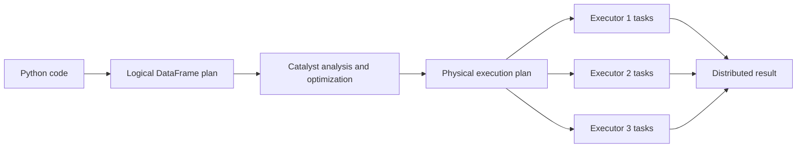

## PySpark Versus Pandas

| Aspect | PySpark DataFrame | Pandas DataFrame |
|---|---|---|
| Execution | Distributed and lazy | Usually local and eager |
| Scale | Multi-machine | Single-machine memory |
| Row order | Not guaranteed unless sorted | Stable index/order semantics |
| Optimization | Catalyst optimizer | Python/library execution |
| Fault recovery | Lineage and task retry | Process-level handling |
| Schema | Explicit Spark SQL types | NumPy/Pandas dtypes |
| Best use | Large ETL, SQL, streaming | Local exploration and medium-sized analytics |

A frequent mistake is to write PySpark as though it were Pandas. Efficient PySpark code describes **columnar transformations**, minimizes shuffles, avoids driver-side loops over rows, and lets Spark optimize a complete plan.

# 2. Distributed-Computing Foundations

## 2.1 Horizontal Scaling

- **Vertical scaling:** buy a larger machine.
- **Horizontal scaling:** divide work across more machines.

Spark primarily uses horizontal scaling. Data is split into **partitions**, and one task generally processes one partition at a time.

## 2.2 Data Locality

Moving computation close to data is often cheaper than moving large data to computation. Modern object stores weaken classic block-locality assumptions, but network movement is still expensive. Spark attempts to schedule tasks where data is accessible efficiently.

## 2.3 Parallelism

Parallelism is bounded by several quantities:

```text
usable concurrency ≈ min(number of runnable tasks,
                         available executor cores,
                         scheduler/resource limits)
```

If a stage has 4 partitions and the cluster has 100 cores, at most 4 tasks from that stage can run simultaneously. If a stage has 10,000 tiny partitions, scheduling overhead may dominate.

## 2.4 Fault Tolerance

Machines fail. Spark handles many failures by:

1. Retrying failed tasks.
2. Recomputing lost partitions from lineage.
3. Replacing failed executors through the cluster manager.
4. Recovering streaming progress from checkpoints and source/sink metadata.

## 2.5 Serialization

The driver sends functions and data metadata to executors. Python worker processes exchange data with executor JVMs. Serialization therefore matters. Large closures, Python UDFs, and driver-created objects can cause overhead or failure.

## 2.6 Distributed Trade-Offs

A distributed system introduces:

- Network latency and bandwidth limits
- Partial failure
- Skewed partition sizes
- Coordination and scheduling overhead
- Nondeterministic completion order
- Expensive global operations such as sorts and exact distinct counts

The correct question is not merely, “Can Spark run this?” It is, “Can this computation be partitioned so that most work is local and network exchange is controlled?”

# 3. Spark Ecosystem

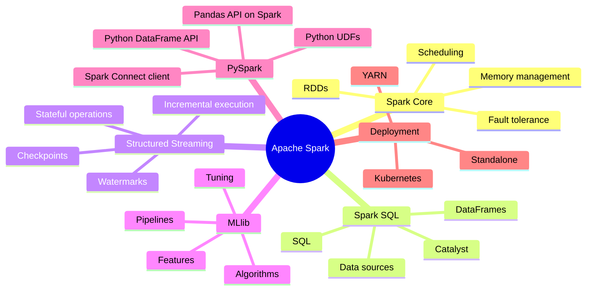

## Major Abstractions

| Abstraction | Purpose | Recommendation |
|---|---|---|
| DataFrame | Distributed structured data with named columns | Default choice for ETL and analytics |
| SQL | Declarative queries over tables/views | Excellent for relational logic |
| RDD | Low-level distributed collection | Use when structured APIs cannot express the computation |
| Structured Streaming DataFrame | Unbounded table processed incrementally | Default Spark streaming engine |
| ML Pipeline | Distributed feature and model stages | Use DataFrame-based `pyspark.ml` APIs |
| Spark Connect session | Remote DataFrame client/server model | Use for decoupled clients and managed services |

## DataFrame and SQL Use the Same Engine

These two expressions can produce equivalent optimized plans:

```python
result_df = employees.groupBy("department").avg("salary")
```

```python
employees.createOrReplaceTempView("employees")
result_sql = spark.sql("""
    SELECT department, AVG(salary) AS avg_salary
    FROM employees
    GROUP BY department
""")
```

Choose the interface that makes the logic clearest. Performance depends on the resulting plan, not whether the plan began as SQL or DataFrame code.

# 4. Cluster Architecture

A Spark application normally consists of a **driver** and multiple **executors**. A cluster manager allocates resources.

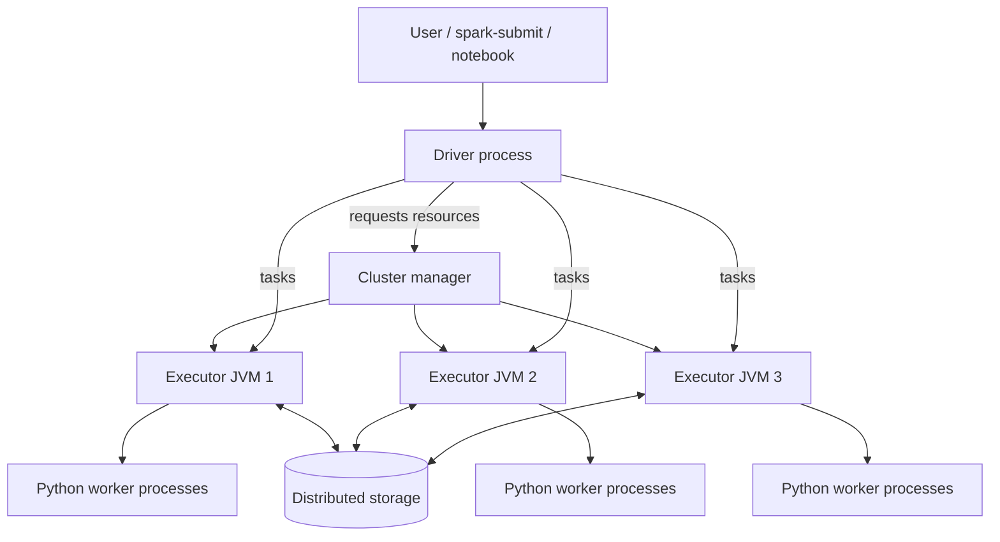

## 4.1 Driver

The driver:

- Runs your main Python program.
- Creates the SparkSession/SparkContext.
- Builds logical and physical plans.
- Creates jobs, stages, and tasks.
- Coordinates executors and tracks metadata.
- Receives results from actions such as `collect()` and `take()`.

The driver is not a general-purpose warehouse for distributed data. Calling `collect()` on a billion rows can exhaust driver memory even when executors are healthy.

## 4.2 Executors

Executors:

- Run tasks.
- Store cached partitions.
- Produce shuffle output and read shuffle input.
- Report metrics and results to the driver.
- Launch/reuse Python workers for Python execution paths.

Executors are application-specific in classic Spark architecture. Their lifetime commonly follows the application, though dynamic allocation may add and remove them.

## 4.3 Cluster Managers

Common choices:

- Spark Standalone
- Hadoop YARN
- Kubernetes

The cluster manager allocates resources; Spark's driver still schedules Spark tasks inside those resources.

## 4.4 Client Mode Versus Cluster Mode

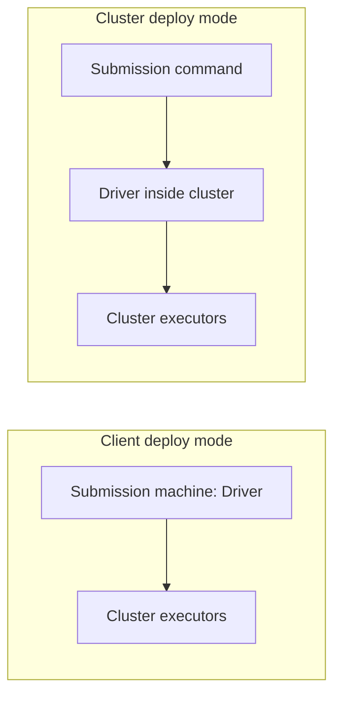

- **Client mode:** driver runs where submission occurs. Useful for interactive shells; network stability between client and cluster matters.
- **Cluster mode:** driver runs inside the cluster. Usually safer for production because the application survives loss of the submission terminal.

# 5. Execution Model: Jobs, Stages, and Tasks

## Definitions

- **Application:** one Spark program with one SparkContext.
- **Job:** work created by an action, such as `count()`, `write`, or `collect()`.
- **Stage:** a set of tasks separated from another set by a shuffle boundary.
- **Task:** the smallest scheduled unit; usually one task per partition in a stage.

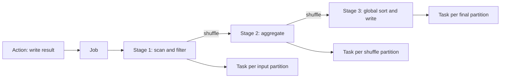

## Example

```python
from pyspark.sql import functions as F

result = (
    sales
    .filter(F.col("amount") > 0)
    .groupBy("country")
    .agg(F.sum("amount").alias("revenue"))
    .orderBy(F.desc("revenue"))
)

result.show()
```

Potential boundaries:

1. File scan and local filter.
2. Shuffle by `country` for aggregation.
3. Shuffle/range exchange for global ordering.

The exact physical plan depends on statistics, configuration, data source, and Adaptive Query Execution.

## Narrow and Wide Dependencies

### Narrow transformation

Each output partition depends on a small number of input partitions.

Examples: `select`, `filter`, many `withColumn` expressions, `map`.

### Wide transformation

Records must be redistributed across partitions.

Examples: `groupBy`, `distinct`, `orderBy`, `repartition`, most large joins.

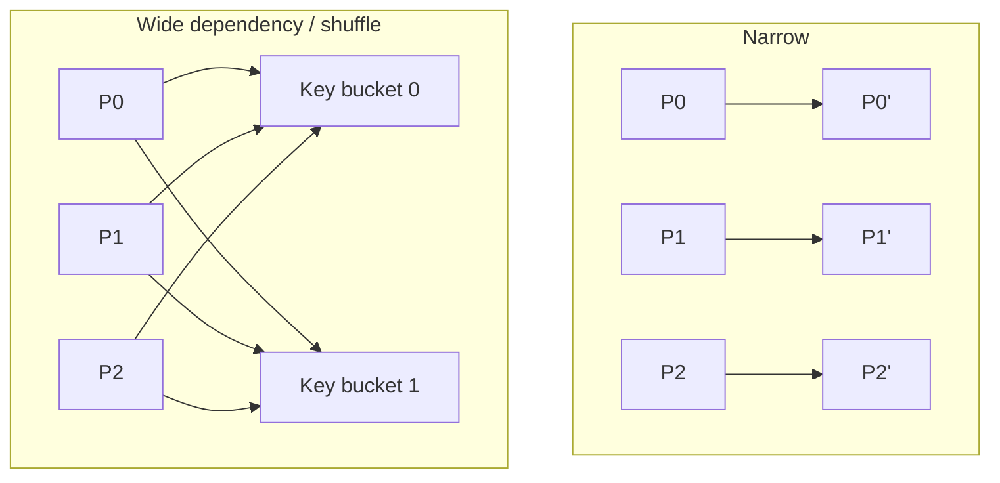

# 6. Lazy Evaluation, DAGs, and Lineage

Most DataFrame transformations are **lazy**. They build a plan but do not immediately process all data.

```python
filtered = employees.filter("salary >= 80000")   # no full job yet
selected = filtered.select("name", "salary")     # still building a plan
selected.show()                                    # action triggers execution
```

## Why Lazy Evaluation Helps

Spark can combine and reorder safe operations, push filters toward data sources, remove unused columns, select join algorithms, and generate optimized code.

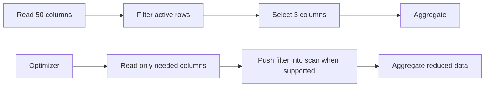

## Lineage

Lineage records how a distributed dataset was derived. If a cached partition is lost, Spark can often recompute it from ancestors.

```text
raw files
   ↓ read
base DataFrame
   ↓ filter
valid rows
   ↓ groupBy / sum
summary
```

Long or unstable lineage can be cut using checkpointing. Caching does not necessarily cut lineage; it stores computed data for reuse but preserves how it was derived.

## Actions

Common actions include:

- `show()`
- `count()`
- `collect()`
- `take(n)` / `head(n)`
- `first()`
- `foreach()` / `foreachPartition()`
- writes such as `.write.parquet(...)`
- streaming `.writeStream.start()`

An action may launch multiple jobs. For example, adaptive planning, schema discovery, or some commands can require additional work.

# 7. Installation and Environment

## 7.1 Local Installation

PySpark 4.2.0 requires a compatible Python version and Java runtime. For the exact version matrix, use the official installation page for your release. A typical isolated setup is:

```bash
python -m venv .venv

# Linux/macOS
source .venv/bin/activate

# Windows PowerShell
# .venv\Scripts\Activate.ps1

python -m pip install --upgrade pip
pip install pyspark==4.2.0
```

Confirm Java:

```bash
java -version
```

Confirm PySpark:

```bash
python -c "import pyspark; print(pyspark.__version__)"
```

Expected:

```text
4.2.0
```

## 7.2 First Program

```python
from pyspark.sql import SparkSession

spark = (
    SparkSession.builder
    .appName("FirstPySparkApp")
    .master("local[*]")
    .getOrCreate()
)

print(spark.version)
print(spark.range(5).collect())

spark.stop()
```

Representative output:

```text
4.2.0
[Row(id=0), Row(id=1), Row(id=2), Row(id=3), Row(id=4)]
```

## 7.3 Local Master Syntax

| Master | Meaning |
|---|---|
| `local` | One worker thread |
| `local[2]` | Two worker threads |
| `local[*]` | As many local threads as available logical cores |
| `local[*, 2]` | Local cores with a configured failure retry count |

Do not hardcode `.master("local[*]")` in production code that will be submitted to a cluster. Supply the master through `spark-submit` or platform configuration.

## 7.4 `spark-submit`

```bash
spark-submit \
  --master yarn \
  --deploy-mode cluster \
  --name daily-sales-etl \
  --conf spark.sql.adaptive.enabled=true \
  jobs/daily_sales.py \
  --input s3a://example/raw/sales \
  --output s3a://example/curated/sales
```

Application arguments appear after the Python file. Spark options appear before it.

# 8. SparkSession and Configuration

`SparkSession` is the main entry point for DataFrames, SQL, catalogs, tables, and streaming.

```python
from pyspark.sql import SparkSession

spark = (
    SparkSession.builder
    .appName("RetailAnalytics")
    .config("spark.sql.adaptive.enabled", "true")
    .config("spark.sql.session.timeZone", "UTC")
    .getOrCreate()
)
```

## Important Principle: Configuration Timing

Some configurations are static or must be supplied before the SparkContext starts. Others are runtime SQL configurations and can be changed with:

```python
spark.conf.set("spark.sql.shuffle.partitions", "200")
print(spark.conf.get("spark.sql.shuffle.partitions"))
```

Output:

```text
200
```

## Inspect Configuration Instead of Assuming Defaults

```python
keys = [
    "spark.sql.adaptive.enabled",
    "spark.sql.shuffle.partitions",
    "spark.sql.autoBroadcastJoinThreshold",
    "spark.sql.session.timeZone",
]

for key in keys:
    try:
        print(key, "=", spark.conf.get(key))
    except Exception:
        print(key, "is unavailable in this environment")
```

Defaults can change across releases and managed platforms. Production code should explicitly set configurations that are critical to correctness, such as session time zone, and carefully manage performance configurations through deployment settings.

## Stop the Session

```python
spark.stop()
```

Interactive notebooks often reuse a managed session. Standalone scripts should stop cleanly.

# 9. DataFrames, Rows, Columns, and Schemas

## 9.1 Creating a DataFrame

```python
from pyspark.sql import SparkSession

spark = SparkSession.builder.appName("DataFrameBasics").getOrCreate()

data = [
    (1, "Asha", "Engineering", 95000.0, True),
    (2, "Bikram", "Finance", 72000.0, True),
    (3, "Charu", "Engineering", 88000.0, False),
    (4, "Danish", None, 65000.0, True),
]

columns = ["employee_id", "name", "department", "salary", "active"]
employees = spark.createDataFrame(data, columns)
employees.show()
```

Output:

```text
+-----------+------+-----------+-------+------+
|employee_id|  name| department| salary|active|
+-----------+------+-----------+-------+------+
|          1|  Asha|Engineering|95000.0|  true|
|          2|Bikram|    Finance|72000.0|  true|
|          3| Charu|Engineering|88000.0| false|
|          4|Danish|       NULL|65000.0|  true|
+-----------+------+-----------+-------+------+
```

## 9.2 Explicit Schema

Explicit schemas prevent expensive or incorrect inference and make contracts clear.

```python
from pyspark.sql import types as T

employee_schema = T.StructType([
    T.StructField("employee_id", T.LongType(), nullable=False),
    T.StructField("name", T.StringType(), nullable=False),
    T.StructField("department", T.StringType(), nullable=True),
    T.StructField("salary", T.DoubleType(), nullable=True),
    T.StructField("active", T.BooleanType(), nullable=False),
])

employees = spark.createDataFrame(data, schema=employee_schema)
employees.printSchema()
```

Output:

```text
root
 |-- employee_id: long (nullable = false)
 |-- name: string (nullable = false)
 |-- department: string (nullable = true)
 |-- salary: double (nullable = true)
 |-- active: boolean (nullable = false)
```

## 9.3 Column Expressions

```python
from pyspark.sql import functions as F

result = employees.select(
    F.col("employee_id"),
    F.upper("name").alias("name_upper"),
    (F.col("salary") * F.lit(1.10)).alias("salary_after_raise"),
)

result.orderBy("employee_id").show()
```

Output:

```text
+-----------+----------+------------------+
|employee_id|name_upper|salary_after_raise|
+-----------+----------+------------------+
|          1|      ASHA|          104500.0|
|          2|    BIKRAM|           79200.0|
|          3|     CHARU|           96800.0|
|          4|    DANISH|           71500.0|
+-----------+----------+------------------+
```

A `Column` is an expression, not the column's local data. `F.col("salary") * 1.10` constructs an expression that Spark later evaluates on executors.

## 9.4 Nested Schemas

```python
nested_schema = T.StructType([
    T.StructField("id", T.IntegerType(), False),
    T.StructField("profile", T.StructType([
        T.StructField("city", T.StringType(), True),
        T.StructField("skills", T.ArrayType(T.StringType()), True),
    ]), True),
])

nested = spark.createDataFrame([
    (1, ("Kolkata", ["Python", "Spark"])),
    (2, ("Pune", ["SQL"])),
], nested_schema)

nested.select("id", "profile.city", F.explode("profile.skills").alias("skill")).show()
```

Output:

```text
+---+-------+------+
| id|   city| skill|
+---+-------+------+
|  1|Kolkata|Python|
|  1|Kolkata| Spark|
|  2|   Pune|   SQL|
+---+-------+------+
```

# 10. Core Transformations and Actions

## 10.1 `select`

```python
employees.select("name", "salary").show()
```

```text
+------+-------+
|  name| salary|
+------+-------+
|  Asha|95000.0|
|Bikram|72000.0|
| Charu|88000.0|
|Danish|65000.0|
+------+-------+
```

## 10.2 `filter` / `where`

```python
employees.filter(
    (F.col("active") == True) & (F.col("salary") >= 70000)
).orderBy("employee_id").show()
```

```text
+-----------+------+-----------+-------+------+
|employee_id|  name| department| salary|active|
+-----------+------+-----------+-------+------+
|          1|  Asha|Engineering|95000.0|  true|
|          2|Bikram|    Finance|72000.0|  true|
+-----------+------+-----------+-------+------+
```

Use `&`, `|`, and `~` for Spark column expressions, and parenthesize each comparison. Python's `and`, `or`, and `not` try to evaluate a distributed expression as a local Boolean and fail.

## 10.3 `withColumn`

```python
employees.withColumn(
    "salary_band",
    F.when(F.col("salary") >= 90000, "High")
     .when(F.col("salary") >= 70000, "Medium")
     .otherwise("Entry")
).orderBy("employee_id").select("name", "salary", "salary_band").show()
```

```text
+------+-------+-----------+
|  name| salary|salary_band|
+------+-------+-----------+
|  Asha|95000.0|       High|
|Bikram|72000.0|     Medium|
| Charu|88000.0|     Medium|
|Danish|65000.0|      Entry|
+------+-------+-----------+
```

## 10.4 Rename and Drop

```python
clean = (
    employees
    .withColumnRenamed("employee_id", "id")
    .drop("active")
)
clean.printSchema()
```

```text
root
 |-- id: long (nullable = false)
 |-- name: string (nullable = false)
 |-- department: string (nullable = true)
 |-- salary: double (nullable = true)
```

## 10.5 Distinct and Duplicates

```python
values = spark.createDataFrame([(1,), (1,), (2,), (2,), (3,)], ["x"])
print(values.count())
print(values.distinct().count())
```

```text
5
3
```

`dropDuplicates(["business_key"])` keeps one arbitrary row per key unless you define a deterministic winner with a window.

## 10.6 Sort

```python
employees.orderBy(F.desc("salary"), F.asc("name")).select("name", "salary").show()
```

```text
+------+-------+
|  name| salary|
+------+-------+
|  Asha|95000.0|
| Charu|88000.0|
|Bikram|72000.0|
|Danish|65000.0|
+------+-------+
```

A global `orderBy` is expensive because it requires global coordination and usually a shuffle. `sortWithinPartitions` only sorts inside each partition.

## 10.7 Safe Sampling of Results

```python
employees.limit(2).collect()
```

Representative output:

```text
[Row(employee_id=1, name='Asha', department='Engineering', salary=95000.0, active=True),
 Row(employee_id=2, name='Bikram', department='Finance', salary=72000.0, active=True)]
```

Use `take`, `head`, or `limit` for bounded inspection. Avoid unbounded `collect()`.

# 11. Reading and Writing Data

## 11.1 CSV

```python
orders = (
    spark.read
    .option("header", True)
    .option("mode", "FAILFAST")
    .schema("order_id long, customer_id long, amount decimal(18,2), order_date date")
    .csv("/data/orders/*.csv")
)
```

Prefer an explicit schema. CSV inference requires extra work and can infer incompatible types when files change.

Common parse modes:

- `PERMISSIVE`: preserve malformed records using a corrupt-record column when configured.
- `DROPMALFORMED`: silently drops malformed rows; use with extreme caution.
- `FAILFAST`: stops on malformed input; useful for strict contracts.

## 11.2 JSON

```python
events = spark.read.schema(event_schema).json("/data/events/date=2026-07-15")
```

JSON is flexible but verbose and expensive compared with columnar formats. Use it at ingestion boundaries, then convert curated data to Parquet or a managed table format.

## 11.3 Parquet

```python
orders.write.mode("overwrite").partitionBy("order_date").parquet("/warehouse/orders")
```

Parquet supports column pruning, predicate pushdown where applicable, compression, and typed schemas.

## 11.4 Read Only What You Need

```python
summary = (
    spark.read.parquet("/warehouse/orders")
    .select("order_date", "customer_id", "amount")
    .filter(F.col("order_date") >= F.lit("2026-07-01").cast("date"))
)
```

Spark can often prune unused columns and partitions. Do not read all columns and later convert to Python objects.

## 11.5 JDBC

```python
jdbc_df = (
    spark.read.format("jdbc")
    .option("url", "jdbc:postgresql://db.example:5432/app")
    .option("dbtable", "public.orders")
    .option("user", "reader")
    .option("password", "${SECRET_FROM_SECURE_STORE}")
    .option("partitionColumn", "order_id")
    .option("lowerBound", "1")
    .option("upperBound", "10000000")
    .option("numPartitions", "16")
    .load()
)
```

Bounds determine partition strides; they do not necessarily filter the table. Choose a reasonably uniform numeric/date partition column and avoid overwhelming the source database with too many concurrent connections.

## 11.6 Write Modes

| Mode | Behavior |
|---|---|
| `append` | Add new output |
| `overwrite` | Replace target according to source/table semantics |
| `error` / `errorifexists` | Fail if target exists |
| `ignore` | Do nothing if target exists |

Filesystem overwrite is not automatically a transactional merge. For upserts, use a table format or database supporting atomic merge semantics.

## 11.7 Small-Files Problem

Writing thousands of tiny files increases listing, scheduling, and metadata overhead.

```python
(
    result
    .repartition(32, "order_date")
    .write
    .mode("overwrite")
    .partitionBy("order_date")
    .parquet("/warehouse/daily_result")
)
```

Do not blindly use `coalesce(1)` for large data. It forces final writing through one partition and can become a severe bottleneck.

# 12. Data Cleaning and Type Handling

## 12.1 Null Semantics

SQL null means unknown/missing. Comparisons with null do not return normal true/false values.

```python
employees.filter(F.col("department").isNull()).show()
```

```text
+-----------+------+----------+-------+------+
|employee_id|  name|department| salary|active|
+-----------+------+----------+-------+------+
|          4|Danish|      NULL|65000.0|  true|
+-----------+------+----------+-------+------+
```

Do not write `col("department") == None`; use `isNull()` and `isNotNull()`.

## 12.2 Fill and Drop Nulls

```python
employees.na.fill({"department": "UNKNOWN", "salary": 0.0}).show()
```

Use business semantics. Replacing every missing numeric value with zero may corrupt meaning.

## 12.3 `coalesce` Expression Versus DataFrame Method

```python
# Column expression: first non-null value
F.coalesce(F.col("preferred_phone"), F.col("backup_phone"))

# DataFrame partition method: reduce number of partitions without a full shuffle when possible
df.coalesce(10)
```

They share a name but solve different problems.

## 12.4 Casting

```python
raw = spark.createDataFrame([("100",), ("bad",), (None,)], ["value"])
raw.select("value", F.col("value").cast("int").alias("as_int")).show()
```

Representative output under permissive casting semantics:

```text
+-----+------+
|value|as_int|
+-----+------+
|  100|   100|
|  bad|  NULL|
| NULL|  NULL|
+-----+------+
```

ANSI mode can make invalid operations fail rather than silently return null. Know your environment's SQL mode and use validation logic.

## 12.5 Dates and Timestamps

```python
raw_dates = spark.createDataFrame([
    ("2026-07-16 08:30:00",),
    ("2026-07-16 19:45:12",),
], ["raw_ts"])

parsed = raw_dates.select(
    F.to_timestamp("raw_ts", "yyyy-MM-dd HH:mm:ss").alias("event_ts")
)
parsed.show(truncate=False)
```

```text
+-------------------+
|event_ts           |
+-------------------+
|2026-07-16 08:30:00|
|2026-07-16 19:45:12|
+-------------------+
```

Set `spark.sql.session.timeZone` explicitly. Timestamp interpretation and display otherwise depend on environment settings.

## 12.6 Strings and Regular Expressions

```python
phones = spark.createDataFrame([
    ("+91 98765-43210",),
    ("(033) 4000 5000",),
], ["raw_phone"])

phones.select(
    "raw_phone",
    F.regexp_replace("raw_phone", r"\D", "").alias("digits")
).show(truncate=False)
```

```text
+---------------+------------+
|raw_phone      |digits      |
+---------------+------------+
|+91 98765-43210|919876543210|
|(033) 4000 5000|03340005000 |
+---------------+------------+
```

## 12.7 Deterministic Deduplication

```python
from pyspark.sql import Window

updates = spark.createDataFrame([
    (1, "old", "2026-07-15 10:00:00"),
    (1, "new", "2026-07-16 09:00:00"),
    (2, "only", "2026-07-14 08:00:00"),
], ["id", "value", "updated_at"])

w = Window.partitionBy("id").orderBy(F.col("updated_at").desc())
latest = (
    updates
    .withColumn("rn", F.row_number().over(w))
    .filter(F.col("rn") == 1)
    .drop("rn")
    .orderBy("id")
)
latest.show()
```

```text
+---+-----+-------------------+
| id|value|         updated_at|
+---+-----+-------------------+
|  1|  new|2026-07-16 09:00:00|
|  2| only|2026-07-14 08:00:00|
+---+-----+-------------------+
```

Add a deterministic tie-breaker if timestamps can be equal.

# 13. Aggregations

## 13.1 Basic Grouped Aggregation

```python
employees.groupBy("department").agg(
    F.count("*").alias("employee_count"),
    F.round(F.avg("salary"), 2).alias("avg_salary"),
    F.max("salary").alias("max_salary"),
).orderBy(F.col("department").asc_nulls_last()).show()
```

```text
+-----------+--------------+----------+----------+
| department|employee_count|avg_salary|max_salary|
+-----------+--------------+----------+----------+
|Engineering|             2|   91500.0|   95000.0|
|    Finance|             1|   72000.0|   72000.0|
|       NULL|             1|   65000.0|   65000.0|
+-----------+--------------+----------+----------+
```

## 13.2 Conditional Aggregation

```python
employees.groupBy("department").agg(
    F.sum(F.when(F.col("active"), 1).otherwise(0)).alias("active_count"),
    F.sum(F.when(~F.col("active"), 1).otherwise(0)).alias("inactive_count"),
).orderBy(F.col("department").asc_nulls_last()).show()
```

```text
+-----------+------------+--------------+
| department|active_count|inactive_count|
+-----------+------------+--------------+
|Engineering|           1|             1|
|    Finance|           1|             0|
|       NULL|           1|             0|
+-----------+------------+--------------+
```

## 13.3 Approximate Aggregation

Exact `countDistinct` can be expensive. For large-scale cardinality estimation, consider:

```python
result = events.agg(F.approx_count_distinct("user_id").alias("estimated_users"))
```

Approximation trades a bounded error for lower resource use. Validate whether the business decision requires exactness.

## 13.4 Rollup and Cube

```python
sales.rollup("country", "product").agg(
    F.sum("amount").alias("revenue")
)
```

`rollup` produces hierarchical subtotals. `cube` produces combinations across dimensions and can grow quickly.

## 13.5 Aggregation Execution

Many aggregations use partial aggregation before the shuffle:

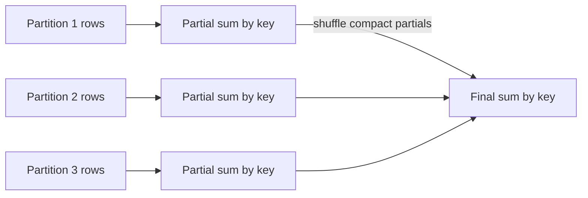

This is why associative/commutative built-in aggregates scale better than collecting all values for each key into Python.

# 14. Window Functions

A window function computes over related rows while preserving row-level output.

## 14.1 Ranking

```python
from pyspark.sql import Window

scores = spark.createDataFrame([
    ("A", "Riya", 90),
    ("A", "Sam", 90),
    ("A", "Tara", 80),
    ("B", "Uma", 95),
    ("B", "Vik", 70),
], ["team", "name", "score"])

w = Window.partitionBy("team").orderBy(F.desc("score"), F.asc("name"))

scores.select(
    "team", "name", "score",
    F.row_number().over(w).alias("row_number"),
    F.rank().over(w).alias("rank"),
    F.dense_rank().over(w).alias("dense_rank"),
).orderBy("team", "row_number").show()
```

Output with the explicit name tie-breaker:

```text
+----+----+-----+----------+----+----------+
|team|name|score|row_number|rank|dense_rank|
+----+----+-----+----------+----+----------+
|   A|Riya|   90|         1|   1|         1|
|   A| Sam|   90|         2|   2|         2|
|   A|Tara|   80|         3|   3|         3|
|   B| Uma|   95|         1|   1|         1|
|   B| Vik|   70|         2|   2|         2|
+----+----+-----+----------+----+----------+
```

Because the window ordering includes `name`, the 90-point rows are not ties. To preserve ties, order only by score; add a separate deterministic ordering only where needed for `row_number`.

## 14.2 Running Total

```python
transactions = spark.createDataFrame([
    (1, "2026-07-01", 100),
    (1, "2026-07-02", 50),
    (1, "2026-07-04", -20),
], ["account_id", "date", "amount"])

w = (
    Window.partitionBy("account_id")
    .orderBy("date")
    .rowsBetween(Window.unboundedPreceding, Window.currentRow)
)

transactions.withColumn(
    "running_balance", F.sum("amount").over(w)
).orderBy("date").show()
```

```text
+----------+----------+------+---------------+
|account_id|      date|amount|running_balance|
+----------+----------+------+---------------+
|         1|2026-07-01|   100|            100|
|         1|2026-07-02|    50|            150|
|         1|2026-07-04|   -20|            130|
+----------+----------+------+---------------+
```

## 14.3 Previous/Next Row

```python
transactions.select(
    "*",
    F.lag("amount").over(Window.partitionBy("account_id").orderBy("date")).alias("previous_amount")
).show()
```

Window functions usually require partitioning and sorting. Large skewed window groups can become memory and runtime hotspots.

# 15. Joins and Set Operations

## 15.1 Join Types

| Join | Result |
|---|---|
| `inner` | Matching rows only |
| `left` / `left_outer` | All left rows plus matches |
| `right` / `right_outer` | All right rows plus matches |
| `full` / `outer` | All rows from both sides |
| `left_semi` | Left rows that have a match; no right columns |
| `left_anti` | Left rows without a match |
| `cross` | Cartesian product |

## 15.2 Example

```python
customers = spark.createDataFrame([
    (1, "Asha"),
    (2, "Bikram"),
    (3, "Charu"),
], ["customer_id", "customer_name"])

orders = spark.createDataFrame([
    (101, 1, 500.0),
    (102, 1, 250.0),
    (103, 4, 900.0),
], ["order_id", "customer_id", "amount"])

customers.join(orders, "customer_id", "left").orderBy("customer_id", "order_id").show()
```

```text
+-----------+-------------+--------+------+
|customer_id|customer_name|order_id|amount|
+-----------+-------------+--------+------+
|          1|         Asha|     101| 500.0|
|          1|         Asha|     102| 250.0|
|          2|       Bikram|    NULL|  NULL|
|          3|        Charu|    NULL|  NULL|
+-----------+-------------+--------+------+
```

## 15.3 Semi and Anti Joins

```python
customers.join(orders, "customer_id", "left_semi").show()
```

```text
+-----------+-------------+
|customer_id|customer_name|
+-----------+-------------+
|          1|         Asha|
+-----------+-------------+
```

```python
customers.join(orders, "customer_id", "left_anti").orderBy("customer_id").show()
```

```text
+-----------+-------------+
|customer_id|customer_name|
+-----------+-------------+
|          2|       Bikram|
|          3|        Charu|
+-----------+-------------+
```

Use semi/anti joins rather than joining and then dropping right-side columns when you only need existence/nonexistence.

## 15.4 Broadcast Join

```python
from pyspark.sql.functions import broadcast

fact_with_country = large_fact.join(
    broadcast(small_country_dimension),
    "country_code",
    "left"
)
```

A broadcast join sends the small relation to executors, avoiding a shuffle of the large relation. Ensure the small side truly fits in executor memory after serialization; row count alone is not enough.

## 15.5 Join-Key Hygiene

Before joining, validate:

- Matching data types
- Whitespace/case normalization where business rules require it
- Null behavior
- Key uniqueness on dimension sides
- Duplicate multiplication
- Skew and hot keys

```python
left_keyed = left.withColumn("join_key", F.upper(F.trim("raw_key")))
right_keyed = right.withColumn("join_key", F.upper(F.trim("raw_key")))
```

## 15.6 Set Operations

```python
a.unionByName(b, allowMissingColumns=True)
```

- `union`/`unionByName` do **not** remove duplicates.
- `intersect` returns common rows.
- `exceptAll` subtracts with duplicate-aware semantics.
- `subtract`/`except` semantics depend on API and duplicate handling; verify requirements explicitly.

## Join Strategy Mental Model

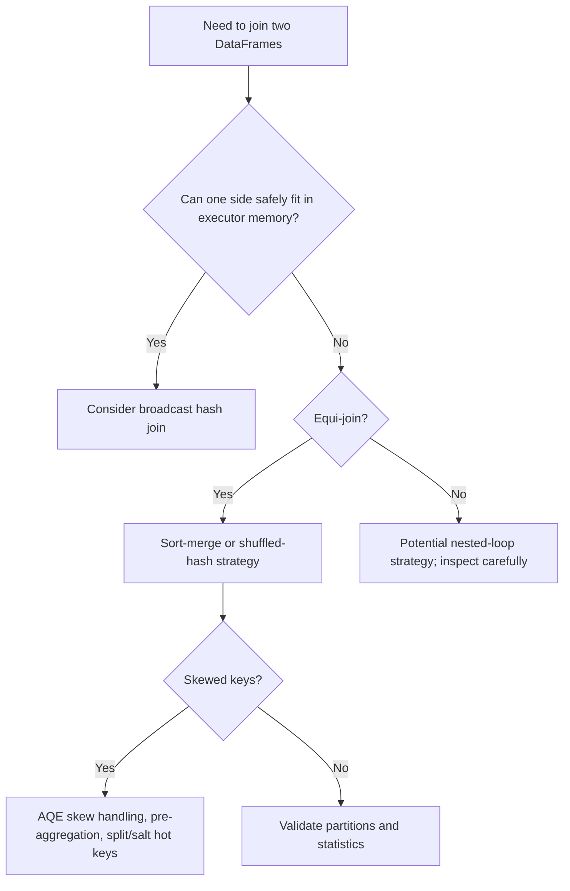

# 16. Partitions, Shuffles, and Data Distribution

## 16.1 Inspect Partition Count

```python
print(employees.rdd.getNumPartitions())
```

The exact local result depends on how the DataFrame was created and local settings.

## 16.2 `repartition`

```python
balanced = events.repartition(200, "customer_id")
```

`repartition` can increase or decrease partitions and normally causes a shuffle. Partitioning by a key places equal keys together, subject to hash/range partitioning semantics.

## 16.3 `coalesce`

```python
fewer = events.coalesce(20)
```

`coalesce` usually reduces partitions without a full shuffle. It is efficient but can create uneven partitions because it combines existing partitions rather than redistributing all records.

## 16.4 `repartitionByRange`

```python
ranged = events.repartitionByRange(100, "event_date", "customer_id")
```

Useful when downstream operations benefit from range distribution, though it still costs a shuffle.

## 16.5 What a Shuffle Does

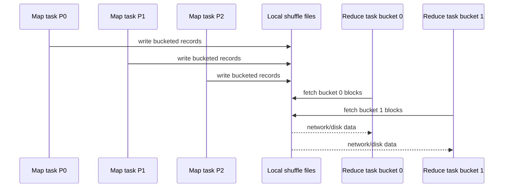

Shuffle cost includes serialization, disk I/O, network transfer, memory pressure, sorting/hashing, and synchronization.

## 16.6 Data Skew

A key is skewed when one or a few keys own a disproportionate number of rows.

Symptoms:

- Most tasks finish quickly; one or two run much longer.
- One task has huge shuffle read/write.
- Executor OOMs occur only for certain partitions.
- Median task duration is low but maximum is extreme.

Detection:

```python
key_counts = events.groupBy("customer_id").count().orderBy(F.desc("count"))
key_counts.show(20, truncate=False)
```

Mitigations:

- Filter irrelevant hot/null keys.
- Pre-aggregate before joining.
- Broadcast the other side when safe.
- Use AQE skew join handling.
- Salt only identified hot keys and correctly de-salt afterward.
- Process exceptional keys separately.

## 16.7 Partition Sizing Is Empirical

No universal row count or megabyte value is correct for every job. Wide rows, nested arrays, compression, CPU-heavy expressions, Python UDFs, and storage throughput change the ideal size. Use stage metrics and task duration to tune.

# 17. Catalyst, Tungsten, Code Generation, and AQE

## 17.1 Catalyst Pipeline

```mermaid
flowchart LR
    A[Unresolved logical plan] --> B[Analyzer]
    B --> C[Resolved logical plan]
    C --> D[Logical optimizer]
    D --> E[Optimized logical plan]
    E --> F[Physical planning]
    F --> G[Candidate physical plans]
    G --> H[Selected physical plan]
    H --> I[Execution / code generation]
```

### Analyzer

Resolves table names, column names, functions, data types, and relationships using catalogs and schemas.

### Logical Optimizer

Examples of logical rewrites:

- Predicate pushdown
- Column pruning
- Constant folding
- Null propagation
- Boolean simplification
- Projection collapsing

### Physical Planner

Chooses implementations such as scan operators, join algorithms, aggregation algorithms, exchanges, and sorts.

## 17.2 Explain Plans

```python
result.explain(mode="formatted")
```

Look for:

- `Exchange`: shuffle/network boundary
- `SortMergeJoin`, `BroadcastHashJoin`, or other join operator
- `HashAggregate` / `ObjectHashAggregate`
- `FileScan` and pushed filters
- `AdaptiveSparkPlan`
- Python execution nodes such as `BatchEvalPython` or Arrow/Pandas nodes

## 17.3 Tungsten and Whole-Stage Code Generation

“Tungsten” refers to execution improvements such as compact binary representations, memory management, cache-aware processing, and generated JVM code. Rather than calling a virtual method for every row and expression, Spark can fuse compatible operators into generated code.

Python UDF boundaries can reduce these benefits because Spark cannot inspect arbitrary Python logic in the same way as built-in expressions.

## 17.4 Adaptive Query Execution

AQE can change parts of the physical plan after runtime statistics become available.

Common capabilities include:

- Coalescing shuffle partitions
- Converting join strategies when runtime size permits
- Handling skewed shuffle partitions
- Optimizing empty relations/partitions

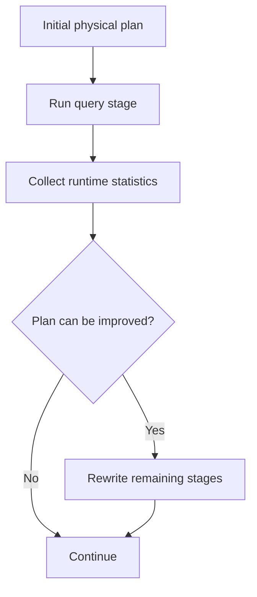

AQE is powerful but not a replacement for sound data modeling. It cannot make an unbounded `collect()` safe, fix a fundamentally wrong join key, or guarantee that a dimension is small enough to broadcast.

## 17.5 Statistics

Cost-based decisions depend on statistics. Managed tables may have statistics; file-based DataFrames may have incomplete estimates. Inspect plans rather than assuming Spark “knows” the true size.

# 18. Caching, Persistence, Checkpointing, Broadcasts, and Accumulators

## 18.1 Cache Only Reused, Expensive Data

```python
from pyspark import StorageLevel

cleaned = expensive_cleaning(raw).persist(StorageLevel.MEMORY_AND_DISK)

cleaned.count()  # materialize cache intentionally
report_a = cleaned.groupBy("country").count()
report_b = cleaned.groupBy("product").agg(F.sum("amount"))

report_a.write.mode("overwrite").parquet("/out/a")
report_b.write.mode("overwrite").parquet("/out/b")

cleaned.unpersist()
```

Caching a DataFrame used once can make the job slower by adding storage and serialization work.

## 18.2 Persistence Levels

Conceptually:

- Memory only
- Memory and disk
- Disk only
- Serialized variants
- Replicated variants

Availability and defaults can vary by API/release. Choose based on recomputation cost, object size, memory pressure, and fault tolerance.

## 18.3 Checkpointing

```python
spark.sparkContext.setCheckpointDir("/reliable/shared/checkpoints")
checkpointed = iterative_df.checkpoint(eager=True)
```

Checkpoint writes data to reliable storage and truncates lineage. Use it for very long plans, iterative algorithms, or streaming state/progress—not as a universal performance trick.

`localCheckpoint()` is faster but uses executor-local storage and offers weaker reliability.

## 18.4 Broadcast Variables

For RDD/Python logic:

```python
country_lookup = spark.sparkContext.broadcast({"IN": "India", "US": "United States"})

rdd = spark.sparkContext.parallelize(["IN", "US", "XX"])
print(rdd.map(lambda code: country_lookup.value.get(code, "Unknown")).collect())
```

```text
['India', 'United States', 'Unknown']
```

For DataFrame joins, use a broadcast join hint/function rather than manually broadcasting a dictionary whenever relational logic is sufficient.

## 18.5 Accumulators

```python
bad_rows = spark.sparkContext.longAccumulator("bad_rows")

rdd = spark.sparkContext.parallelize(["10", "x", "20"])

def parse(value):
    try:
        return int(value)
    except ValueError:
        bad_rows.add(1)
        return None

print(rdd.map(parse).collect())
print(bad_rows.value)
```

Representative output:

```text
[10, None, 20]
1
```

Accumulators are useful for diagnostics, but task retries and speculative execution can complicate side-effect expectations. Do not use them as a transactional business counter.

# 19. UDFs, Arrow UDFs, Pandas UDFs, and `applyInPandas`

## 19.1 Preference Order

1. Built-in Spark SQL function
2. SQL expression
3. Higher-order array/map function
4. Arrow-optimized scalar Python UDF when unavoidable
5. Pandas UDF for vectorized batch logic
6. Grouped Pandas APIs only when group sizes are controlled
7. RDD/Python row logic as a last resort for structured data

## 19.2 Built-In Function Instead of UDF

Avoid:

```python
from pyspark.sql.functions import udf

@udf("string")
def normalize_email_udf(value):
    return value.strip().lower() if value else None
```

Prefer:

```python
normalized = df.withColumn("email", F.lower(F.trim("email")))
```

Spark understands the built-in expression and can optimize around it.

## 19.3 Scalar Python UDF

```python
from pyspark.sql.functions import udf

@udf(returnType="int", useArrow=True)
def string_length(value):
    return len(value) if value is not None else None

spark.createDataFrame([("Spark",), (None,)], ["text"]).select(
    "text", string_length("text").alias("length")
).show()
```

```text
+-----+------+
| text|length|
+-----+------+
|Spark|     5|
| NULL|  NULL|
+-----+------+
```

In Spark 4.2, Arrow optimization behavior for regular Python UDFs changed compared with older versions. Test type coercion during upgrades.

## 19.4 Pandas UDF

```python
import pandas as pd
from pyspark.sql.functions import pandas_udf

@pandas_udf("double")
def zscore(values: pd.Series) -> pd.Series:
    std = values.std()
    if std == 0 or pd.isna(std):
        return pd.Series([0.0] * len(values))
    return (values - values.mean()) / std

spark.createDataFrame([(10.0,), (20.0,), (30.0,)], ["x"]).select(
    "x", zscore("x").alias("z")
).show()
```

Representative output (floating-point formatting may vary):

```text
+----+----+
|   x|   z|
+----+----+
|10.0|-1.0|
|20.0| 0.0|
|30.0| 1.0|
+----+----+
```

## 19.5 `applyInPandas`

```python
schema = "customer_id long, event_ts timestamp, value double, centered double"

def center_group(pdf: pd.DataFrame) -> pd.DataFrame:
    pdf = pdf.sort_values("event_ts")
    pdf["centered"] = pdf["value"] - pdf["value"].mean()
    return pdf

result = events.groupBy("customer_id").applyInPandas(center_group, schema=schema)
```

All rows for one group may need to fit in one Python worker's memory. A single giant group can cause OOM even when the whole cluster has abundant memory.

## 19.6 Arrow Batch Size

Arrow transfers columnar batches between JVM and Python. Very large/wide batches increase memory pressure; tiny batches increase overhead. Tune only after profiling and ensure correctness for timestamps, decimals, nested types, and nulls.

# 20. Spark SQL, Views, Catalogs, and Tables

## 20.1 Temporary View

```python
employees.createOrReplaceTempView("employees")

spark.sql("""
    SELECT department,
           COUNT(*) AS employee_count,
           ROUND(AVG(salary), 2) AS avg_salary
    FROM employees
    GROUP BY department
    ORDER BY department NULLS LAST
""").show()
```

## 20.2 Global Temporary View

A global temporary view is scoped to the Spark application and accessed through a system database, commonly `global_temp`:

```python
employees.createOrReplaceGlobalTempView("employees_global")
spark.sql("SELECT * FROM global_temp.employees_global").show()
```

## 20.3 Managed and External Tables

Conceptually:

- **Managed table:** catalog manages table metadata and typically data lifecycle.
- **External table:** catalog tracks metadata while data lifecycle is managed separately.

Actual deletion/ownership semantics depend on catalog and table provider. Verify on your platform before destructive operations.

## 20.4 Save as Table

```python
(
    employees.write
    .mode("overwrite")
    .saveAsTable("analytics.employees")
)
```

## 20.5 Partition Pruning

If a table is physically partitioned by `event_date`, use direct predicates on that column:

```python
filtered = spark.table("analytics.events").filter(
    (F.col("event_date") >= F.lit("2026-07-01")) &
    (F.col("event_date") <= F.lit("2026-07-15"))
)
```

Wrapping the partition column in complex functions can prevent pruning in some cases. Inspect scan details in `explain()` and the SQL UI.

## 20.6 SQL Injection and Dynamic SQL

Do not directly concatenate untrusted user input into SQL strings. Use validated identifiers, parameterization features where supported, DataFrame expressions, or a strict allow-list.

# 21. RDD Theory and Practice

An **RDD** is an immutable distributed collection partitioned across the cluster. RDDs provide transformations, actions, lineage, persistence, shared variables, and explicit key/value operations.

## 21.1 Create and Transform

```python
rdd = spark.sparkContext.parallelize([1, 2, 3, 4], 2)
result = rdd.map(lambda x: x * x).filter(lambda x: x > 4).collect()
print(result)
```

```text
[9, 16]
```

## 21.2 Word Count

```python
lines = spark.sparkContext.parallelize([
    "spark makes data parallel",
    "spark supports python",
])

counts = (
    lines
    .flatMap(lambda line: line.split())
    .map(lambda word: (word.lower(), 1))
    .reduceByKey(lambda a, b: a + b)
    .sortByKey()
)

print(counts.collect())
```

```text
[('data', 1), ('makes', 1), ('parallel', 1), ('python', 1), ('spark', 2), ('supports', 1)]
```

## 21.3 `reduceByKey` Versus `groupByKey`

For summation:

```python
pairs.reduceByKey(lambda a, b: a + b)
```

is usually better than:

```python
pairs.groupByKey().mapValues(sum)
```

`reduceByKey` can combine data locally before shuffle. `groupByKey` sends all values and materializes iterables for each key.

## 21.4 `mapPartitions`

```python
def initialize_once_per_partition(rows):
    # Create a costly client once here, not once per row.
    for row in rows:
        yield row * 10

print(spark.sparkContext.parallelize([1, 2, 3, 4], 2)
      .mapPartitions(initialize_once_per_partition)
      .collect())
```

```text
[10, 20, 30, 40]
```

For external writes, `foreachPartition` can reduce connection setup, but retries can duplicate side effects. Use idempotency and transactional sinks.

## 21.5 When to Use RDDs

Use RDDs when:

- You need a low-level transformation not expressible with DataFrames.
- Data is genuinely unstructured and schema adds little value.
- You need custom partitioner semantics or specialized libraries.

Avoid RDDs for ordinary structured ETL because Spark cannot apply the same schema-aware SQL optimizations, and Python object serialization is expensive.

# 22. Structured Streaming

Structured Streaming models a live stream as an unbounded table. You express DataFrame transformations; Spark executes them incrementally.

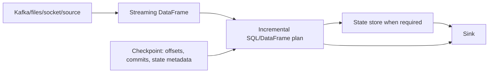

## 22.1 Rate Source Example

```python
stream = (
    spark.readStream
    .format("rate")
    .option("rowsPerSecond", 5)
    .load()
)

query = (
    stream
    .withColumn("bucket", F.col("value") % 2)
    .groupBy("bucket")
    .count()
    .writeStream
    .format("console")
    .outputMode("complete")
    .option("checkpointLocation", "/tmp/checkpoints/rate-demo")
    .start()
)

query.awaitTermination()
```

Representative console batches:

```text
-------------------------------------------
Batch: 2
-------------------------------------------
+------+-----+
|bucket|count|
+------+-----+
|     0|    8|
|     1|    7|
+------+-----+
```

Counts vary because they depend on runtime duration.

## 22.2 Micro-Batch Model

Most Structured Streaming workloads run as repeated micro-batches:

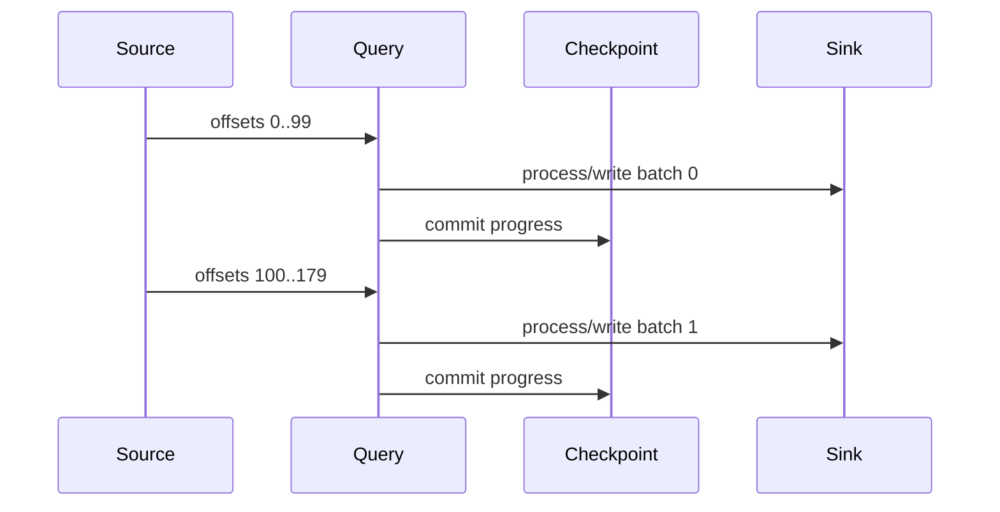

## 22.3 Output Modes

- **Append:** emit newly finalized rows.
- **Update:** emit rows changed since the prior trigger.
- **Complete:** emit the entire result table each trigger.

Availability depends on query type and sink.

## 22.4 Event Time and Watermarks

```python
aggregated = (
    events
    .withWatermark("event_time", "10 minutes")
    .groupBy(
        F.window("event_time", "5 minutes"),
        "device_id"
    )
    .agg(F.count("*").alias("event_count"))
)
```

A watermark is not a promise that every row arriving within exactly ten minutes is accepted or that all later rows are immediately dropped. It is a state-cleanup threshold based on observed event-time progress and query semantics.

## 22.5 Stream-Static Join

```python
riched = streaming_orders.join(
    F.broadcast(static_products),
    "product_id",
    "left"
)
```

Refresh semantics for the static side depend on how the query and source are constructed. Long-running queries may require restart or a design that loads changing dimensions appropriately.

## 22.6 Stream-Stream Join

State can grow without bounds unless event-time constraints and watermarks allow old state to be removed.

Conceptual condition:

```text
left.key = right.key
AND right.event_time BETWEEN left.event_time - 5 minutes
                         AND left.event_time + 10 minutes
```

## 22.7 Exactly-Once Claims

End-to-end guarantees depend on the source, checkpointing, query, sink, and side effects. A retry-safe idempotent/transactional sink is essential. `foreachBatch` does not magically make an arbitrary external API exactly-once.

## 22.8 `foreachBatch`

```python
def write_batch(batch_df, batch_id):
    deduped = batch_df.dropDuplicates(["event_id"])
    # Use batch_id and event_id to make the sink idempotent.
    deduped.write.mode("append").parquet("/warehouse/events")

query = (
    parsed.writeStream
    .foreachBatch(write_batch)
    .option("checkpointLocation", "/checkpoints/events")
    .start()
)
```

## 22.9 Streaming Operations to Monitor

- Input rows per second
- Processed rows per second
- Trigger duration
- Source lag
- State-operator row count and memory
- Watermark progression
- Failed batches and retry behavior
- Sink latency

# 23. MLlib and Machine-Learning Pipelines

The DataFrame-based API under `pyspark.ml` is the primary MLlib API.

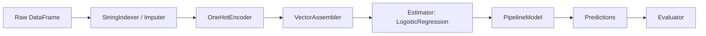

## 23.1 Classification Example

```python
from pyspark.ml import Pipeline
from pyspark.ml.classification import LogisticRegression
from pyspark.ml.feature import StringIndexer, OneHotEncoder, VectorAssembler
from pyspark.ml.evaluation import BinaryClassificationEvaluator

training = spark.createDataFrame([
    (0.0, 25.0, 30000.0, "mobile"),
    (1.0, 45.0, 90000.0, "desktop"),
    (0.0, 22.0, 28000.0, "mobile"),
    (1.0, 50.0, 110000.0, "desktop"),
    (1.0, 38.0, 75000.0, "tablet"),
    (0.0, 27.0, 35000.0, "mobile"),
], ["label", "age", "income", "device"])

indexer = StringIndexer(inputCol="device", outputCol="device_index", handleInvalid="keep")
encoder = OneHotEncoder(inputCols=["device_index"], outputCols=["device_vec"])
assembler = VectorAssembler(inputCols=["age", "income", "device_vec"], outputCol="features")
lr = LogisticRegression(featuresCol="features", labelCol="label", maxIter=20)

pipeline = Pipeline(stages=[indexer, encoder, assembler, lr])
model = pipeline.fit(training)
predictions = model.transform(training)

predictions.select("label", "probability", "prediction").show(truncate=False)
```

Representative structure:

```text
+-----+----------------------------------------+----------+
|label|probability                             |prediction|
+-----+----------------------------------------+----------+
|0.0  |[high_probability_for_0, ...]           |0.0       |
|1.0  |[..., high_probability_for_1]           |1.0       |
|...  |...                                     |...       |
+-----+----------------------------------------+----------+
```

Exact probabilities depend on solver behavior, numerical libraries, and data.

## 23.2 Why Pipelines Matter

The fitted model stores transformations learned from training data, such as category index mappings. Apply the complete `PipelineModel` to validation and inference data to avoid training-serving skew.

## 23.3 Train/Test Split

```python
train, test = data.randomSplit([0.8, 0.2], seed=42)
```

For time-dependent data, random splitting can leak future information. Use chronological splits where appropriate.

## 23.4 Hyperparameter Tuning

Cross-validation multiplies training cost by parameter combinations and folds. Cache reused feature data, limit the grid, use train-validation split when appropriate, and account for cluster concurrency.

## 23.5 Save and Load

```python
model.write().overwrite().save("/models/churn_pipeline")

from pyspark.ml import PipelineModel
loaded = PipelineModel.load("/models/churn_pipeline")
```

Persist feature definitions, label semantics, data version, metrics, and runtime versions alongside the model.

# 24. Spark Connect

Spark Connect separates the client from the Spark driver. The client builds unresolved logical plans and sends them to a server over gRPC; results can return in Arrow-encoded batches.

```mermaid
sequenceDiagram
    participant P as Python client
    participant G as gRPC / Protocol Buffers
    participant D as Spark Connect server / Driver
    participant E as Executors

    P->>G: unresolved logical plan
    G->>D: plan request
    D->>D: analyze and optimize
    D->>E: tasks
    E-->>D: distributed result
    D-->>P: Arrow result batches
```

## Connect Client

```python
from pyspark.sql import SparkSession

spark = (
    SparkSession.builder
    .remote("sc://spark-connect-host:15002")
    .appName("RemoteAnalytics")
    .getOrCreate()
)

spark.range(10).groupBy((F.col("id") % 2).alias("bucket")).count().show()
```

## Important Differences from Classic PySpark

- Client and driver are separate processes.
- No direct access to private JVM fields such as `df._jdf`.
- RDDs and SparkContext-dependent APIs are not supported in the same way.
- Server and client can be upgraded more independently, subject to protocol compatibility.
- Dependencies and Python code execution require Connect-compatible deployment patterns.

Use documented public DataFrame APIs and check whether each API is labeled as supporting Spark Connect.

# 25. Deployment and Resource Planning

## 25.1 Resource Vocabulary

- Executor instances: number of executor JVMs
- Executor cores: simultaneous task slots per executor, approximately
- Executor memory: JVM heap budget
- Memory overhead: off-heap, Python workers, native libraries, direct buffers, and other non-heap usage
- Driver memory: planning, metadata, collected results, broadcasts, and application code

## 25.2 Example `spark-submit`

```bash
spark-submit \
  --master k8s://https://kubernetes.default.svc \
  --deploy-mode cluster \
  --name customer-360 \
  --conf spark.executor.instances=20 \
  --conf spark.executor.cores=4 \
  --conf spark.executor.memory=12g \
  --conf spark.executor.memoryOverhead=4g \
  --conf spark.driver.memory=8g \
  --conf spark.sql.adaptive.enabled=true \
  local:///opt/jobs/customer_360.py
```

This is an example, not a universal recommendation. Workload type, node size, Python usage, data volume, and platform quotas determine appropriate values.

## 25.3 Executor Sizing Trade-Offs

Very large executors:

- Fewer JVMs and less duplicated overhead
- But larger garbage-collection impact and blast radius
- More tasks/Python workers competing for the same executor resources

Very small executors:

- Better isolation and potentially faster replacement
- But more JVM, scheduling, shuffle connection, and broadcast overhead

Tune using real stage metrics.

## 25.4 Dynamic Allocation

Dynamic allocation can add/remove executors according to backlog and idleness. It improves utilization but must be compatible with shuffle tracking/service, cached data expectations, streaming latency, and platform configuration.

## 25.5 Packaging Python Dependencies

Common options:

- Install dependencies in the container/cluster image.
- Ship a virtual environment/archive.
- Use `--py-files` for pure-Python modules and zip/egg files.
- Build reproducible images for native dependencies.

Driver and executors need compatible Python versions and libraries.

## 25.6 Secrets

Never embed passwords in code or command history. Use your platform's secret manager and access-control model. Restrict Spark UI/event-log access because plans and environment details may reveal sensitive metadata.

# 26. Monitoring and Debugging

Every classic SparkContext normally launches a web UI, often beginning at port `4040`. Completed applications can be reviewed through the Spark History Server when event logging is enabled.

## 26.1 UI Tabs and Questions

| Area | Questions to ask |
|---|---|
| Jobs | Which action launched this work? Which jobs failed? |
| Stages | Where are shuffles? Which stage dominates runtime? |
| Tasks | Is the max duration far above median? Is there skew? |
| Storage | What is cached? How much is in memory/disk? |
| SQL | Which physical operators and exchanges are expensive? |
| Executors | Are executors lost? Is GC or memory pressure high? |
| Environment | Which configuration actually applied? |

## 26.2 Debugging Flow

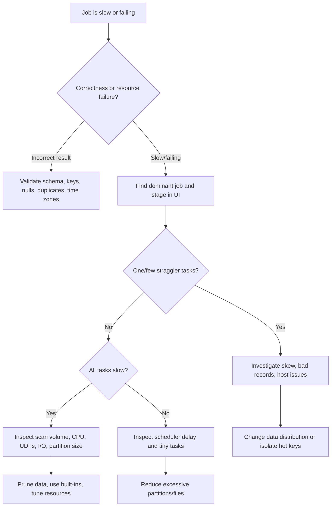

## 26.3 Useful Programmatic Checks

```python
print("Spark version:", spark.version)
print("Partitions:", df.rdd.getNumPartitions())
df.printSchema()
df.explain(mode="formatted")
```

Data quality checks:

```python
metrics = df.agg(
    F.count("*").alias("row_count"),
    F.sum(F.col("business_key").isNull().cast("long")).alias("null_keys"),
    F.countDistinct("business_key").alias("distinct_keys"),
).collect()[0]
print(metrics)
```

Bounded aggregated results are safer to collect than raw datasets.

## 26.4 Common Failure Classes

- Driver OOM: unbounded collect, huge plan, excessive metadata, giant broadcast creation
- Executor OOM: skewed partition, oversized cache, large Python groups, too many concurrent tasks
- Fetch failure: lost shuffle data, executor loss, network/storage issue
- Serialization error: closure contains non-serializable object
- Analysis error: unresolved/ambiguous columns, type mismatch
- Stage retry exhaustion: deterministic bad record, repeated OOM, unavailable external system

Read the earliest relevant exception, not only the final wrapper message.

# 27. Testing and Production Engineering

## 27.1 Separate Pure Transformations from I/O

```python
from pyspark.sql import DataFrame, functions as F


def transform_orders(df: DataFrame) -> DataFrame:
    return (
        df
        .filter(F.col("amount") > 0)
        .withColumn("order_date", F.to_date("order_ts"))
        .withColumn("email", F.lower(F.trim("email")))
        .select("order_id", "customer_id", "order_date", "amount", "email")
    )
```

This function is easy to test using a tiny local DataFrame.

## 27.2 Example Test

```python
def test_transform_orders(spark):
    source = spark.createDataFrame([
        (1, 10, "2026-07-16 10:00:00", 100.0, " A@EXAMPLE.COM "),
        (2, 20, "2026-07-16 11:00:00", -5.0, "b@example.com"),
    ], ["order_id", "customer_id", "order_ts", "amount", "email"])

    actual = transform_orders(source).orderBy("order_id").collect()

    assert len(actual) == 1
    assert actual[0]["order_id"] == 1
    assert actual[0]["email"] == "a@example.com"
    assert str(actual[0]["order_date"]) == "2026-07-16"
```

## 27.3 Test More Than Rows

Validate:

- Schema and nullability where critical
- Duplicate behavior
- Nulls
- Empty input
- Boundary dates and time zones
- Malformed records
- Join multiplicity
- Idempotency
- Partitioned writes and reruns

## 27.4 Data Contracts

At ingestion, assert required columns and compatible types:

```python
required = {"order_id", "customer_id", "amount", "order_ts"}
missing = required - set(df.columns)
if missing:
    raise ValueError(f"Missing required columns: {sorted(missing)}")
```

For types, compare `df.schema` against a versioned contract and explicitly handle allowed evolution.

## 27.5 Idempotency

A production batch job should usually be safe to rerun for the same logical interval. Patterns include:

- Overwrite one immutable date partition atomically.
- Merge by stable business key and event version.
- Write to a staging location, validate, then publish/rename/commit.
- Record a run identifier and source version.

Plain append is not idempotent.

## 27.6 Logging

Log structured facts, not entire DataFrames:

- Run ID
- Input paths/versions
- Row counts and rejected counts
- Output location
- Applied configuration identifiers
- Timing per phase
- Data quality metrics

Avoid sensitive values and excessive per-row logging from executors.

# 28. End-to-End ETL Example

## Problem

Build a daily customer-sales summary from raw CSV orders and a Parquet customer dimension.

Requirements:

- Enforce schema.
- Quarantine malformed/invalid rows.
- Normalize email.
- Keep the latest customer dimension row per customer.
- Aggregate daily revenue.
- Write partitioned Parquet output.
- Produce bounded quality metrics.

## Implementation

```python
from pyspark.sql import SparkSession, DataFrame, Window
from pyspark.sql import functions as F, types as T

spark = (
    SparkSession.builder
    .appName("DailyCustomerSales")
    .config("spark.sql.session.timeZone", "UTC")
    .config("spark.sql.adaptive.enabled", "true")
    .getOrCreate()
)

order_schema = T.StructType([
    T.StructField("order_id", T.LongType(), True),
    T.StructField("customer_id", T.LongType(), True),
    T.StructField("order_ts", T.StringType(), True),
    T.StructField("amount", T.DecimalType(18, 2), True),
    T.StructField("email", T.StringType(), True),
])

raw_orders = (
    spark.read
    .option("header", True)
    .option("mode", "PERMISSIVE")
    .option("columnNameOfCorruptRecord", "_corrupt_record")
    .schema(order_schema.add(T.StructField("_corrupt_record", T.StringType(), True)))
    .csv("/landing/orders/business_date=2026-07-15")
)

parsed = (
    raw_orders
    .withColumn("order_timestamp", F.to_timestamp("order_ts", "yyyy-MM-dd HH:mm:ss"))
    .withColumn("normalized_email", F.lower(F.trim("email")))
)

is_valid = (
    F.col("_corrupt_record").isNull()
    & F.col("order_id").isNotNull()
    & F.col("customer_id").isNotNull()
    & F.col("order_timestamp").isNotNull()
    & (F.col("amount") > 0)
)

valid_orders = (
    parsed.filter(is_valid)
    .withColumn("order_date", F.to_date("order_timestamp"))
    .select(
        "order_id", "customer_id", "order_timestamp", "order_date",
        "amount", "normalized_email"
    )
)

rejected_orders = parsed.filter(~is_valid)

customer_history = spark.read.parquet("/warehouse/customer_history")

latest_window = Window.partitionBy("customer_id").orderBy(
    F.col("effective_at").desc(),
    F.col("source_sequence").desc()
)

latest_customers = (
    customer_history
    .withColumn("rn", F.row_number().over(latest_window))
    .filter(F.col("rn") == 1)
    .drop("rn")
    .select("customer_id", "country", "segment")
)

fact = valid_orders.join(latest_customers, "customer_id", "left")

summary = (
    fact
    .groupBy("order_date", "country", "segment")
    .agg(
        F.countDistinct("order_id").alias("order_count"),
        F.sum("amount").alias("revenue"),
        F.countDistinct("customer_id").alias("customer_count"),
    )
)

quality = parsed.agg(
    F.count("*").alias("input_rows"),
    F.sum(is_valid.cast("long")).alias("valid_rows"),
    F.sum((~is_valid).cast("long")).alias("rejected_rows"),
).collect()[0]

print(quality)

(
    summary
    .repartition("order_date")
    .write
    .mode("overwrite")
    .partitionBy("order_date")
    .parquet("/warehouse/daily_customer_sales")
)

(
    rejected_orders
    .write
    .mode("overwrite")
    .parquet("/quarantine/orders/business_date=2026-07-15")
)

spark.stop()
```

## Why This Design Is Better Than a Row Loop

- Schema and validation are columnar.
- Filters and projections remain visible to Catalyst.
- Only bounded aggregate metrics return to the driver.
- Deduplication has deterministic ordering.
- Invalid data is preserved for investigation.
- Output partitioning is aligned with common date access.

## Production Improvements

- Parameterize dates and paths.
- Use transactional table semantics for atomic publication.
- Add source-file and ingestion metadata.
- Validate uniqueness of `order_id`.
- Track metric thresholds and fail when quality degrades.
- Add integration tests for reruns and partial failures.

# 29. Performance-Tuning Playbook

## 29.1 Tune in This Order

1. Confirm result correctness.
2. Measure baseline runtime and data volume.
3. Find the dominant job/stage/operator.
4. Reduce input through partition pruning, filter pushdown, and column pruning.
5. Replace Python UDFs with built-ins where possible.
6. Fix join multiplicity and choose appropriate join strategies.
7. Diagnose skew.
8. Tune partition counts and file sizes.
9. Cache only verified reuse points.
10. Adjust resources and configurations.
11. Re-measure and document the change.

## 29.2 Decision Diagram

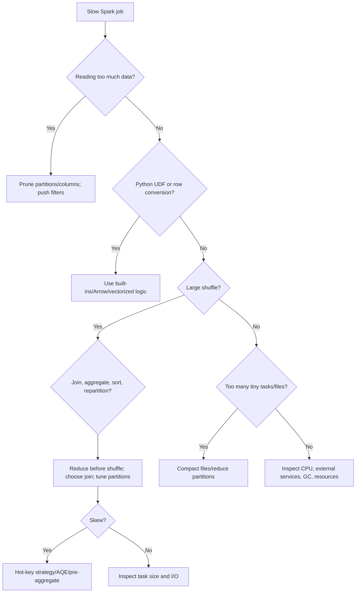

## 29.3 Anti-Patterns

| Anti-pattern | Why it hurts | Better approach |
|---|---|---|
| `collect()` then Python loop | Driver bottleneck/OOM | Distributed transformations or bounded aggregates |
| `toPandas()` on unknown data | Single-machine memory risk | Aggregate/sample first; enforce a size guard |
| Python UDF for `lower`, regex, date logic | Serialization and opaque logic | Built-in SQL functions |
| `groupByKey` for sums | Shuffles all values | `reduceByKey` or DataFrame aggregation |
| `coalesce(1)` for large output | Single-task bottleneck | Controlled multi-file output |
| Cache everything | Memory pressure and extra work | Cache reused expensive intermediates only |
| Repartition after every step | Repeated shuffles | Repartition only for a downstream need |
| Join without checking key uniqueness | Row explosion | Validate multiplicity and deduplicate dimensions |
| Global sort before every write | Expensive shuffle | Sort only when consumers require it |
| Guessing from total job time | Hides root cause | Use stage/task/operator metrics |

## 29.4 Data-Volume Reduction Example

Bad:

```python
all_data = spark.read.parquet("/lake/events")
result = all_data.select("*").filter(F.year("event_time") == 2026)
```

Better when `event_date` is a partition column:

```python
result = (
    spark.read.parquet("/lake/events")
    .filter(
        (F.col("event_date") >= "2026-01-01") &
        (F.col("event_date") < "2027-01-01")
    )
    .select("event_date", "user_id", "event_type")
)
```

## 29.5 Plan Comparison

```python
result.explain(mode="formatted")
```

After an optimization, compare:

- Files/bytes scanned
- Pushed filters and partition filters
- Number and size of exchanges
- Join operator
- Task count
- Median and maximum task duration
- Shuffle read/write
- Spill
- Executor loss and retries
- End-to-end cost, not only one stage

# 30. Top 100 Situational Questions and Detailed Answers

These questions are designed for interviews, production troubleshooting, design reviews, and senior-level PySpark discussions. Each answer focuses on diagnosis, reasoning, and a practical response rather than memorized definitions.

---


## A. Fundamentals, API Choice, and Execution


### 1. Your dataset is 3 GB and fits comfortably in local memory. Should you automatically use PySpark?


Not automatically. Spark adds JVM startup, scheduling, serialization, task coordination, and often cluster cost. First test a local engine such as Pandas or Polars with the actual transformations. Use Spark when the workload is too large or too slow locally, must integrate with distributed storage, needs fault-tolerant production scheduling, or will grow materially.

A useful decision process is:

1. Measure local runtime and peak memory.
2. Estimate growth and concurrent workload.
3. Consider where the data already lives.
4. Compare operational complexity and cost.

A 3 GB Parquet dataset with selective columns may be trivial locally, while 3 GB of deeply nested JSON plus expensive joins may not be. Choose Spark for distributed requirements, not merely because it is available. A well-designed local job is often faster and simpler for modest data.


### 2. You define five transformations, but nothing appears in the Spark UI. Is Spark broken?


Probably not. DataFrame transformations are lazy. `select`, `filter`, `withColumn`, and `groupBy` build a logical plan; they do not necessarily launch a job. An action such as `show`, `count`, `collect`, a write, or `writeStream.start()` triggers execution.

```python
planned = source.filter("amount > 0").select("customer_id", "amount")
planned.explain()       # inspects the plan
print(planned.count())  # launches execution
```

This behavior lets Catalyst optimize the complete pipeline before running it. Do not insert actions merely to “make each line execute”; that can force repeated scans and materialization. Insert actions intentionally for outputs, bounded diagnostics, or cache materialization. In the UI, associate each job with the action that triggered it rather than with the last transformation written.


### 3. A developer calls `collect()` on a production DataFrame and the driver crashes. What happened?


`collect()` transfers every row to the driver as Python objects. The distributed cluster may have terabytes of aggregate memory, but the driver is still one process with finite heap and Python memory. The result can exceed driver memory, message-size limits, or serialization capacity.

Replace the operation according to the real goal:

- Preview: `df.limit(100).show(truncate=False)`
- Scalar metric: `df.agg(...).collect()[0]`
- Export: distributed `.write`
- Per-partition processing: `foreachPartition`, with retry-safe side effects
- Local analysis: aggregate/sample first and enforce a size guard before `toPandas()`

Increasing driver memory only postpones failure if the result is unbounded. The design error is moving distributed data to a single machine without a proven bound.


### 4. The same DataFrame displays rows in a different order on two runs. Is the result incorrect?


Not necessarily. Distributed DataFrames do not guarantee row order unless the plan contains an ordering requirement. Tasks finish independently, partitions may be coalesced differently by AQE, and file listing order may change.

For deterministic presentation or testing, specify a total ordering:

```python
stable = df.orderBy("business_key", "event_time", "tie_breaker")
```

A partial order is not enough when duplicate sort keys exist. Add a stable tie-breaker if exact row sequence matters. Avoid global sorting only to make internal processing “look stable”; it is expensive. Most pipelines should treat data as an unordered relation and sort only at a required boundary, such as a report, deterministic test fixture, or ordered export contract.


### 5. A job reads `/tmp/input.csv` successfully in local mode but fails on a cluster. Why?


`/tmp/input.csv` refers to the local filesystem of the process reading it. In local mode, driver and workers share one machine. In cluster mode, executors run on other nodes where that path may not exist or may contain different data.

Use storage visible to all executors, such as HDFS, cloud object storage, a distributed filesystem, or a correctly mounted shared volume. If the file is a tiny dependency rather than distributed input, ship it using the platform's file-distribution mechanism and resolve the executor-local path appropriately.

Also check deploy mode: in client mode, a driver-local path can exist on the submission machine while executor tasks still cannot see it. Production data paths must have explicit, cluster-wide accessibility and permissions.


### 6. A transformation references a database client created on the driver and fails with a serialization error. What is wrong?


Spark serializes the task closure and sends it to executors. Database connections, locks, open file handles, loggers with native state, and many client objects are not serializable. Even if serialization succeeds, one driver-created network connection cannot safely be reused from remote executor processes.

Create resources inside `mapPartitions` or `foreachPartition`:

```python
def process_partition(rows):
    client = create_client()
    try:
        for row in rows:
            yield transform_with_client(row, client)
    finally:
        client.close()
```

For DataFrames, prefer native connectors or bulk reads/writes rather than row-by-row remote calls. Remember that tasks can retry, so external writes must be idempotent or transactional. Copy only small serializable configuration into the closure, not live clients.


### 7. The driver uses Python 3.12 but executors use another minor version. Why can the job fail?


Classic PySpark expects compatible Python environments on driver and workers. Serialized Python functions and data cross process boundaries, and installed packages, ABI compatibility, and interpreter behavior must align. A version mismatch can produce worker startup errors, pickle failures, or subtle dependency problems.

Standardize the environment through a container image, cluster image, packaged virtual environment, or platform-managed runtime. Set the relevant Python environment variables at submission time when needed, and verify them on executors rather than only on the driver. Native libraries require compatible operating-system packages as well.

Reproducibility requires pinning the Python version, PySpark/Spark version, and application dependencies together.


### 8. A notebook tries to create a second SparkContext and receives an error. Why is one context normally expected?


A SparkContext owns scheduler state, executor communication, configuration, and application resources. Multiple active contexts in one JVM/process create conflicting lifecycle and resource-management behavior and are generally unsupported.

Use the existing `SparkSession`, retrieve it with `getOrCreate()`, and create isolated SQL sessions with `spark.newSession()` only when you need separate SQL configuration/catalog state while sharing the same underlying context.

```python
spark = SparkSession.builder.getOrCreate()
child = spark.newSession()
```

Do not stop a managed notebook session unless the platform expects it. In standalone tests, use a session-scoped fixture and stop it once after the suite or test scope.


### 9. One call to `show()` appears to create more than one job. How is that possible?


An action is a logical trigger, not a promise of exactly one job. Spark may launch extra jobs for file/schema metadata, exchange reuse, subqueries, broadcast preparation, adaptive query stages, or command-specific behavior. Some data sources and catalog operations also perform preliminary work.

Use the SQL tab and job descriptions to see which physical query and subquery created each job. The important optimization unit is the complete plan and its stages, not a simplistic one-action-equals-one-job rule.

If repeated actions cause repeated full scans, persist a reused expensive intermediate and materialize it once. But do not cache merely because an action produced multiple jobs; first identify whether the extra jobs are costly and avoidable.


### 10. A team needs byte-for-byte reproducible output files. Is `orderBy` enough?


`orderBy` defines row order in the DataFrame, but byte-for-byte reproducibility also depends on partition count, partition boundaries, file naming, compression library/version, writer metadata, null formatting, timestamp zone, and output committer behavior.

For a small controlled export, you may use a fixed partitioning and sorting scheme, but a single partition is not suitable for large data. For scalable deterministic output, define:

- A stable partitioning function and partition count
- A total sort order within each partition
- Fixed writer options and runtime versions
- A publication layer that normalizes file names if required

Often the better contract is semantic reproducibility—same rows, schema, and partition values—rather than identical bytes. Clarify the real consumer requirement before paying the cost of global deterministic layout.


## B. Schemas, Types, Nulls, and Data Quality


### 11. CSV schema inference classifies an identifier as numeric and removes leading zeros. How do you prevent this?


Do not infer schemas for contract-driven ingestion. Define the identifier as `StringType`, because values such as `00123` are labels, not quantities.

```python
schema = "customer_code string, amount decimal(18,2), event_date date"
df = spark.read.option("header", True).schema(schema).csv(path)
```

Validate format separately with a regular expression and quarantine invalid values. Converting an identifier to a number can irreversibly lose leading zeros and may also overflow. Explicit schemas improve correctness, avoid an inference pass, and make schema evolution reviewable.


### 12. A filter `df.department != None` returns unexpected results. What should be used?


SQL null has three-valued logic. Equality/inequality with null does not behave like ordinary Python object comparison. Use `isNull()` or `isNotNull()`:

```python
known = df.filter(F.col("department").isNotNull())
unknown = df.filter(F.col("department").isNull())
```

For null-safe equality between two columns, use the null-safe comparison operator/API supported by Spark, such as `eqNullSafe`:

```python
same = df.filter(F.col("left_key").eqNullSafe(F.col("right_key")))
```

Also distinguish missing from empty strings and sentinel values. A robust data contract normalizes and measures all three rather than treating them interchangeably.


### 13. Financial totals differ by a few paise/cents after aggregation. Why can `DoubleType` be the cause?


Binary floating-point cannot exactly represent many decimal fractions. Repeated arithmetic can accumulate small errors. Monetary values should usually use `DecimalType(precision, scale)` with sufficient headroom for multiplication and sums.

```python
amount = F.col("raw_amount").cast("decimal(18,2)")
```

Choose precision based on the largest possible intermediate, not only input values. Spark's decimal rules can widen results; exceeding supported precision may round, return null, or fail depending on settings. Keep currency conversion and rounding rules explicit, and round at the business-defined stage—not arbitrarily after every operation.


### 14. Timestamps shift by several hours between environments. What should you inspect?


Inspect the Spark session time zone, source timestamp semantics, parsing format, storage type, and destination behavior. Spark stores timestamp instants and displays/interprets them according to timestamp type and session settings.

Set the session zone explicitly:

```python
spark.conf.set("spark.sql.session.timeZone", "UTC")
```

Determine whether source strings represent UTC, a named local zone, or timezone-naive wall-clock values. Use conversion functions deliberately and test daylight-saving transitions for relevant regions. Do not rely on the driver's operating-system time zone. Include exact timestamp type and zone semantics in the data contract.


### 15. Malformed CSV rows are disappearing silently. How do you make ingestion auditable?


Avoid `DROPMALFORMED` for governed pipelines. Use an explicit schema and either fail fast or capture corrupt records in permissive mode.

```python
raw = (spark.read
       .option("header", True)
       .option("mode", "PERMISSIVE")
       .option("columnNameOfCorruptRecord", "_corrupt_record")
       .schema(schema_with_corrupt_column)
       .csv(path))
```

Split valid and rejected records, write the rejected rows with source-file metadata and a reason code, and track counts. Set a quality threshold that fails the run when corruption exceeds an acceptable rate. Auditable quarantine is better than silent deletion or allowing malformed data to contaminate downstream tables.


### 16. A new optional column appears in JSON files. How should schema evolution be handled?


Treat evolution as a versioned contract. Add nullable fields intentionally, keep readers backward compatible where possible, and record the source schema version. Do not rely on ad hoc inference across a directory because mixed files can produce unstable or overly broad types.

For additive evolution, supply the new schema and let old records produce null for the new field. For type changes, create a new canonical column and explicitly parse both old and new representations. Validate counts by schema version and quarantine incompatible records.

When writing tables, verify the table format/catalog's schema-evolution rules. A file being readable does not mean the downstream table accepts or interprets it safely.


### 17. A dimension table unexpectedly has duplicate business keys. Why is that dangerous?


Joining a fact row to two dimension rows multiplies the fact, inflating counts and sums. Before joining, measure uniqueness:

```python
duplicates = dimension.groupBy("business_key").count().filter("count > 1")
```

Then decide whether duplicates are data errors, historical versions, or a legitimate many-to-many relationship. For slowly changing history, select the row valid at the fact event time or deterministically choose the latest current row. Do not hide the problem with an arbitrary `dropDuplicates`; that can select different attributes across runs.

Add an assertion or data-quality metric so uniqueness regressions fail early rather than silently corrupting aggregates.


### 18. Why can `dropDuplicates(["id"])` keep a different row on another run?


The method guarantees one row per key, not which row survives. Without an ordering rule, multiple candidate rows are equivalent to the distributed engine.

Use a window with a total order:

```python
w = Window.partitionBy("id").orderBy(
    F.col("updated_at").desc(),
    F.col("source_priority").desc(),
    F.col("ingestion_id").desc()
)
latest = df.withColumn("rn", F.row_number().over(w)).filter("rn = 1").drop("rn")
```

The final tie-breaker must itself be stable and unique when exact selection matters. Document the survivor rule as business logic and test ties explicitly.


### 19. You need to flatten an array of structs but preserve rows with empty arrays. What should you use?


`explode` removes rows whose array is null or empty. Use `explode_outer` to preserve a row and emit null for the exploded element:

```python
flattened = df.select(
    "record_id",
    F.explode_outer("items").alias("item")
).select("record_id", "item.product_id", "item.quantity")
```

Decide whether null and empty arrays have different meanings. If you need array position, use `posexplode_outer`. Flatten only necessary fields; exploding multiple independent arrays can create a Cartesian multiplication. For parallel arrays, verify alignment and consider `arrays_zip` before exploding.


### 20. Invalid numeric strings become null in one environment but fail in another. Why?


SQL ANSI settings and release/platform defaults can change invalid-cast behavior. In permissive behavior, a bad cast may yield null; under ANSI behavior, it can raise an exception.

Do not let correctness depend on an implicit default. Inspect/set the relevant SQL configuration, and use tolerant parsing functions when available or explicit validation:

```python
is_integer = F.col("raw").rlike(r"^[+-]?\d+$")
parsed = F.when(is_integer, F.col("raw").cast("long"))
```

Track rejected values and test the job under the exact production configuration. Upgrade testing should include malformed inputs because stricter type coercion often reveals hidden data-quality issues.


## C. Joins, Keys, and Relationship Semantics


### 21. A left join doubles revenue. What is the first thing to investigate?


Check join cardinality, especially duplicate keys on the right side. Compare row counts before and after, count distinct fact identifiers, and inspect keys with multiple dimension matches.

```python
right.groupBy("key").count().filter("count > 1").orderBy(F.desc("count")).show()
```

Then confirm the intended relationship: one-to-one, many-to-one, one-to-many, or many-to-many. If the dimension is versioned, join using validity dates or select one deterministic record. Never “fix” inflated totals by applying `distinct` after the join; that can remove legitimate duplicate facts and hides the incorrect relationship.


### 22. A forced broadcast join causes executor OOM even though the dimension has few rows. Why?


Row count is not memory size. A small number of rows may contain large strings, arrays, maps, or binary values. Broadcast data is materialized and replicated to executors, with serialization and hash-table overhead. Multiple concurrent broadcasts also compete for memory.

Estimate serialized size, inspect plan statistics, and avoid forcing broadcast when size is uncertain. Project only required columns and pre-filter the dimension. If it is still large, allow a shuffle join or redesign the dimension.

A broadcast threshold is a planning hint, not a guarantee of safety. Executor memory overhead and concurrent tasks matter as much as heap size.


### 23. A large equi-join spends most time sorting and shuffling. What optimizations should you evaluate?


First reduce both sides: filter early, select only required columns, and pre-aggregate if detail is unnecessary. Verify the join is not multiplying rows. Then inspect whether one side can safely broadcast, whether partition pruning is effective, and whether runtime statistics allow AQE to improve the strategy.

For repeated joins on stable large datasets, storage layout, clustering, or bucketed/table-format optimizations may help on compatible platforms, but they require exact conditions and should be verified in the physical plan.

Tune shuffle partitions from observed task sizes and skew. Adding executor memory before reducing unnecessary shuffled bytes is usually treating the symptom.


### 24. One join task runs for 40 minutes while hundreds finish in seconds. What is the likely cause?


This is a classic skew signal. One shuffle partition probably contains a hot key or an unusually large record/group. Confirm by comparing task shuffle-read sizes and profiling top key frequencies.

Mitigations include filtering meaningless null/default keys, pre-aggregating, broadcasting the other side, enabling/configuring AQE skew handling, processing hot keys separately, or salting identified hot keys. Salting requires duplicating or transforming the other side correctly and de-salting aggregates afterward.

Do not increase every executor's memory without diagnosing the hot key; the same partition can remain a straggler and simply consume more resources.


### 25. Rows with null join keys do not match even when both sides are null. Is that expected?


Yes, ordinary SQL equality treats null as unknown, so `NULL = NULL` is not true. Decide the business meaning. Often null means “unknown” and should not match. If nulls should be treated as equal, use null-safe equality explicitly:

```python
condition = left.key.eqNullSafe(right.key)
joined = left.join(right, condition, "left")
```

Avoid replacing null with a common sentinel unless that sentinel cannot occur naturally and the semantics are documented. Also profile null-key volume; a huge null bucket can create severe skew even when nulls are filtered or specially handled.


### 26. A left join followed by a filter on a right-side column loses unmatched rows. Why?


After a left join, unmatched right columns are null. A filter such as `right.status = 'ACTIVE'` rejects those nulls, effectively turning the result into an inner join.

Place the right-side eligibility condition inside the join or explicitly preserve nulls:

```python
eligible_right = right.filter(F.col("status") == "ACTIVE")
result = left.join(eligible_right, "key", "left")
```

This usually expresses intent most clearly. Alternatively, filter with `(status == 'ACTIVE') | status.isNull()` when that is truly the desired semantics. Test unmatched keys to prevent this common correctness regression.


### 27. A join fails with an ambiguous-column error after both sides contain `status`. How do you avoid it?


Alias both DataFrames and select explicitly:

```python
l = left.alias("l")
r = right.alias("r")
joined = l.join(r, F.col("l.id") == F.col("r.id"), "left")
result = joined.select(
    F.col("l.id").alias("id"),
    F.col("l.status").alias("left_status"),
    F.col("r.status").alias("right_status")
)
```

Joining by a shared column name (`left.join(right, "id")`) can automatically keep one key column, but other duplicate names remain. Establish a naming convention at boundaries and avoid carrying unnecessary duplicate columns through long plans.


### 28. You only need left rows that have at least one matching right row. Which join is best?


Use a `left_semi` join. It returns left columns only and represents existence directly:

```python
matched_customers = customers.join(orders.select("customer_id"), "customer_id", "left_semi")
```

An inner join can duplicate left rows when the right side has multiple matches and then requires a `distinct`, adding work and potentially masking cardinality problems. A semi join gives the optimizer a clearer relational operation and preserves each qualifying left row according to left-side multiplicity.


### 29. You need records that have no match in a reference table. Should you use `NOT IN`?


Use a `left_anti` join for clear distributed semantics:

```python
missing = facts.join(reference.select("key"), "key", "left_anti")
```

`NOT IN` has tricky null semantics: a null in the candidate set can make the predicate unknown. `left_anti` is usually easier to reason about, though you must still define how null keys should be treated. Filter or handle nulls explicitly and validate whether reference keys are unique when measuring unmatched counts.


### 30. A non-equi range join is extremely slow. Why can it become a nested-loop operation?


Hash and sort-merge joins are naturally suited to equality predicates. Conditions such as `left.value BETWEEN right.low AND right.high` may not map to an efficient equi-join strategy and can produce expensive nested-loop behavior, especially if neither side is small.

Options include broadcasting a genuinely small interval table, converting the problem to buckets plus a residual range predicate, using specialized spatial/range indexing available on the platform, or redesigning data into effective-date partitions. Always inspect the physical plan and estimate candidate-pair growth. A logically simple range condition can be computationally quadratic.


### 31. A many-to-many join is intentional. How do you prevent downstream users from mistaking multiplied rows for errors?


Make grain explicit. Document that each output row represents a relationship pair, not an original entity. Include stable identifiers from both sides and publish expected multiplicity metrics, such as matches per left key and per right key.

If downstream aggregation needs original measures, allocate or deduplicate according to a defined rule rather than summing a repeated measure blindly. For example, a campaign-to-customer bridge table should carry allocation weights if campaign cost is distributed across customers.

Add tests with a known many-to-many fixture and verify aggregate invariants. Correct many-to-many modeling is a data-contract problem, not merely a join syntax problem.


### 32. Will pre-partitioning two DataFrames by the join key always eliminate the join shuffle?


No. DataFrame partitioning is not a durable promise across arbitrary operations and storage reads. Spark requires compatible distribution, partition count, partitioning expressions, and plan properties. A prior `repartition` may be lost through writes/reads or invalidated by transformations, and the optimizer may still insert exchanges.

Inspect the physical plan for `Exchange` operators. Table bucketing or clustering can sometimes enable shuffle reduction when all compatibility conditions are met, but support varies by source and platform.

Do not add expensive pre-shuffles speculatively. Measure whether Spark reuses the distribution and whether the total pipeline improves.


### 33. After a join, selecting `*` creates confusing duplicate columns. What is the production-safe pattern?


Treat join output as a new schema contract. Alias inputs and explicitly project the required columns, renaming collisions:

```python
result = (orders.alias("o")
          .join(customers.alias("c"), "customer_id", "left")
          .select(
              "o.order_id", "o.customer_id", "o.amount",
              F.col("c.status").alias("customer_status")))
```

This also improves column pruning and prevents accidental schema expansion when the dimension gains new fields. `select("*")` across evolving tables couples downstream consumers to every source column and can introduce ambiguous or duplicate names without review.


### 34. Two string keys look identical but do not join. What checks should you perform?


Check leading/trailing whitespace, case, Unicode normalization, non-breaking spaces, hidden control characters, punctuation, and inconsistent zero-padding. Compare lengths and hexadecimal/encoded representations for suspicious samples.

Normalize according to business rules, not indiscriminately:

```python
normalized = F.upper(F.trim(F.regexp_replace("raw_key", r"\s+", " ")))
```

Unicode normalization may require a controlled UDF or upstream standardization if no suitable built-in exists. Preserve the raw key for audit, create a canonical key, and measure collisions introduced by normalization. Two distinct legitimate identifiers must not be merged merely because normalization is aggressive.


### 35. A streaming query joins a static dimension, but dimension updates are not visible. What is happening?


A “static” DataFrame is typically planned/read according to query lifecycle and source behavior; it is not automatically a continuously refreshed lookup. A long-running query may keep using the same snapshot or file listing.

Options include restarting the query on dimension publication, reading the current dimension inside `foreachBatch`, using a streaming changelog for the dimension and a stateful join, or querying an external serving store with a carefully designed batch interface. Each choice changes consistency and latency.

Document whether enrichment is event-time as-of, processing-time latest, or snapshot-at-start. Without that semantic decision, “refresh the dimension” is underspecified.


## D. Performance, Partitions, Caching, and Python Overhead


### 36. Reading a table with 500,000 tiny files is slow before computation begins. What is the root issue?


File listing, metadata operations, task creation, and per-file open costs dominate. The data volume may be modest, but the file count creates a control-plane and scheduling problem.

Compact data into appropriately sized columnar files, reduce overly granular partitioning, and use a table format/catalog with metadata pruning where appropriate. For ongoing streaming ingestion, schedule compaction and control sink partition/file generation.

Increasing executor cores does not solve driver-side listing and scheduling overhead. Track both bytes and file counts as data-lake health metrics.


### 37. A team uses `coalesce(1)` so consumers receive one CSV file. Why is the job slow?


One final partition means one task writes all rows. The cluster becomes mostly idle while one executor performs serialization, compression, and I/O, and that task may run out of memory or disk.

Better options:

- Deliver a directory of part files as the dataset contract.
- Produce a bounded number of files with `repartition(n)`.
- Use a downstream file-combination service for genuinely small exports.
- Write a table rather than a monolithic CSV.

If a single file is mandatory and the result is proven small, aggregate first, enforce a maximum size, and then coalesce. Treat it as an export boundary, not a general storage pattern.


### 38. A stage has one partition and a 100-core cluster. Why is only one core busy?


Spark schedules approximately one task per partition for the stage. With one partition, the stage exposes one task regardless of available cores.

Find where parallelism collapsed: `coalesce(1)`, a single unsplittable input, a global operation, or an upstream API returning one partition. Repartition before expensive parallel work if data size justifies it:

```python
parallel = df.repartition(200)
```

This introduces a shuffle, so place it deliberately. If the data is genuinely tiny, one task may be correct and the cluster size is irrelevant. Optimize wall time and cost, not CPU utilization as an isolated goal.


### 39. A stage has 200,000 tasks that each run for 50 milliseconds. What should you change?


Scheduler and task-launch overhead likely dominate. Reduce partition count, compact tiny input files, and avoid repeated repartitions. AQE may coalesce shuffle partitions, but it cannot necessarily fix tiny source partitions caused by huge file counts.

Inspect scheduler delay versus executor run time. Combine input files through source options/platform features or rewrite the dataset. For downstream shuffles, lower the partition count based on actual shuffle size and desired task duration.

Do not simply increase cores; more concurrency can increase pressure without reducing per-task overhead enough.


### 40. Each task processes several gigabytes and spills heavily. What is the likely fix?


Partitions are too large for the operation and executor memory budget, or skew concentrates data. Increase relevant partition counts, fix skew, reduce row width, filter earlier, and avoid grouping unbounded values. Check whether too many cores per executor cause multiple large tasks to compete for the same memory.

Spill is not always a failure—Spark uses disk to remain correct—but excessive spill increases I/O and runtime. Compare median and maximum partition sizes to distinguish global undersplitting from skew. Tune based on stage metrics rather than a universal target partition size.


### 41. Caching a DataFrame makes the job slower. Why?


Caching adds computation to materialize the cache, serialization/storage cost, memory pressure, and possible eviction/spill. If the DataFrame is used once, cheap to recompute, or only partially consumed, caching is wasteful.

Verify reuse count and lineage cost. Persist immediately before multiple expensive downstream branches, materialize once if predictable behavior is needed, and unpersist after the last use. Cache the narrowest useful projection rather than a wide raw DataFrame.

Also inspect whether the cache fits. A partially cached dataset can cause a mix of cache reads and recomputation that is worse than a clean scan from an efficient columnar source.


### 42. You called `cache()`, but the first downstream action is still slow. Is the cache ineffective?


`cache()` is lazy. The first action computes and stores partitions while also producing its result. Later actions benefit if the cache remains available.

```python
cached = expensive.persist()
cached.count()  # optional explicit materialization
```

Materializing is useful when you want to isolate timing or ensure cache population before concurrent consumers, but it is an extra action. Check the Storage tab and the physical plan for in-memory scans. If transformations after caching differ, Spark may not reuse the cached plan. Cache the exact common subplan and avoid nondeterministic expressions that prevent safe reuse.


### 43. Three reports independently read and clean the same large source. How can you avoid repeated work?


Factor the common deterministic cleaning into one DataFrame, persist it if the reports run in the same application, and branch from that shared object.

```python
base = clean(source).select(required_common_columns).persist()
base.count()
report1 = ...
report2 = ...
report3 = ...
```

If reports run as separate applications, materialize a curated intermediate table rather than relying on application-local cache. This creates a reusable data product, but introduces storage and freshness considerations. Choose between cache and persisted curated data based on application boundaries and reuse frequency.


### 44. An RDD word count uses `groupByKey().mapValues(sum)` and is slow. What should replace it?


Use `reduceByKey` or `aggregateByKey`, which can combine values locally before the shuffle:

```python
counts = pairs.reduceByKey(lambda a, b: a + b)
```

`groupByKey` transfers every value and materializes all values for a key, increasing network and memory use. It is appropriate only when you truly need the complete collection of values and can bound group size. For structured data, a DataFrame `groupBy().agg()` often provides better optimization and memory representation.


### 45. A Python UDF that only lowercases strings consumes most runtime. What should you do?


Replace it with the built-in function:

```python
df = df.withColumn("normalized", F.lower(F.trim("raw")))
```

A Python UDF creates a JVM-Python execution boundary and hides logic from Catalyst. Built-ins can participate in code generation, column pruning, and expression optimization. Even Arrow-optimized UDFs have overhead and should not replace a one-line native expression.

Use UDFs only for logic genuinely unavailable in Spark SQL functions, and profile the correct Arrow/type behavior for your Spark release.


### 46. A grouped `applyInPandas` crashes for one customer. Why can total cluster memory be irrelevant?


Grouped Pandas operations often load an entire group into one Python worker. If one customer owns millions of wide rows, that one group must fit within one task/worker's memory. Cluster-wide memory cannot split a single group automatically.

Profile group-size distribution. Replace the operation with window/built-in aggregations if possible, split oversized groups, pre-aggregate, or redesign the algorithm to process bounded chunks. Setting Arrow batch size does not necessarily limit grouped-data memory because group semantics require complete groups for many APIs.


### 47. A developer collects one million keys and passes them to `isin`. What can go wrong?


The driver must hold the list, the logical plan/serialized expression becomes huge, and every executor may receive a large literal set. Planning time and driver memory can explode.

Keep the keys as a DataFrame and use a semi join:

```python
filtered = facts.join(keys.select("key").distinct(), "key", "left_semi")
```

If the key relation is truly small, Spark may broadcast it automatically or you can hint broadcast after measuring size. Relational data should generally remain distributed rather than being converted to Python collections.


### 48. Exact `countDistinct` is expensive on billions of rows. What alternatives exist?


Ask whether exactness is required. `approx_count_distinct` uses a probabilistic sketch and can dramatically reduce resource use while providing controlled relative error.

For recurring metrics, pre-aggregate by partition/date and merge compatible sketches if your platform supports them, or maintain a transactional aggregate table. Filtering and projecting the key before aggregation also reduce cost.

Do not silently replace exact with approximate. Record the error tolerance, validate against exact counts on samples, and ensure business decisions can accept the approximation.


### 49. A pipeline globally sorts data before every intermediate write. Why is this wasteful?


Global sort requires a range exchange and sorting across the entire dataset. Most storage readers do not require global row order, and file formats/tables are relational rather than ordered streams.

Sort only when a consumer contract, window operation, merge optimization, or deterministic export requires it. `sortWithinPartitions` may be sufficient for per-file order after intentional partitioning. Remove cosmetic sorts used only to inspect data; apply ordering to a small preview instead.


### 50. A developer calls `repartition(200)` after almost every transformation. What is the consequence?


Each repartition normally causes a full shuffle, writing and transferring data repeatedly. Narrow transformations such as `select` and `filter` do not require repartitioning.

Repartition only for a concrete downstream need: increasing parallelism after a severe filter, aligning data by a join/aggregation key when the plan benefits, controlling output distribution, or fixing an observed partition problem. Inspect physical plans because Spark may optimize some exchanges, but do not rely on exchange elimination to rescue an unnecessarily shuffle-heavy design.


### 51. An iterative job builds an extremely long logical plan and planning becomes slow. What can help?


Long iterative lineage can make analysis, optimization, code generation, and failure recovery expensive. Materialize at a justified boundary using checkpointing or a durable intermediate table.

```python
spark.sparkContext.setCheckpointDir(shared_path)
current = current.checkpoint(eager=True)
```

Cache alone may not truncate lineage. Also refactor loops that add hundreds of expressions or unions; generate expressions in one projection and combine input paths before reading when possible. Checkpointing adds I/O, so use it at strategic milestones, not every iteration.


### 52. A loop calls `withColumn` hundreds of times and the driver spends minutes planning. What is better?


Build a single projection or use `withColumns` where available:

```python
expressions = {
    f"feature_{i}": build_expression(i)
    for i in range(500)
}
result = df.withColumns(expressions)
```

Alternatively, construct `select("*", *new_columns)`. Repeated `withColumn` can create deeply nested projection plans and large generated plans. Also question whether hundreds of independent features belong in one wide table; arrays/maps or staged feature tables may be more manageable.


### 53. AQE is enabled, but a join is still slow. Why is AQE not a universal solution?


AQE optimizes based on runtime statistics within supported transformations. It cannot fix incorrect keys, massive many-to-many multiplication, Python UDF bottlenecks, unbounded collection, external API latency, or data that must genuinely be shuffled.

Inspect the final adaptive plan, not only the initial plan. Confirm that runtime statistics are available and that relevant AQE features/configurations are active. Then address data reduction, skew, join semantics, and partitioning directly. AQE is an optimizer, not a substitute for architecture and data quality.


### 54. A stage reports large disk spill but completes successfully. Should spill always be eliminated?


No. Spill is a safety mechanism that lets sorts/aggregations exceed in-memory buffers. Some spill can be acceptable and cheaper than allocating oversized executors.

Investigate when spill dominates runtime, saturates local disks, or accompanies failures. Reduce shuffled data, increase partition count, fix skew, narrow rows, and tune executor concurrency/memory. Compare spill per task and disk throughput. The target is efficient, stable completion—not necessarily zero spill.


### 55. Executors spend a high percentage of time in garbage collection. What should you examine?


High GC can result from oversized executor heaps, many concurrent memory-heavy tasks, object-heavy RDD/Python paths, large broadcasts, caching pressure, or skew. Examine heap occupancy, task concurrency, storage usage, and allocation patterns.

Prefer DataFrame built-ins and compact encodings, reduce executor cores if too many tasks compete, right-size partitions, unpersist unused data, and reconsider very large executors. Increasing heap may worsen pause duration. Tune JVM options only after correcting data and workload design; GC flags cannot compensate for a giant skewed partition.


## E. Failures, Reliability, and Production Operations


### 56. Executors are repeatedly lost during one stage. What evidence should you collect?


Correlate Spark executor-loss messages with cluster-manager/container logs, node events, exit codes, memory-limit kills, disk pressure, and stage task metrics. Determine whether losses follow specific partitions, hosts, or overall load.

If the same large partition triggers losses, investigate skew or oversized tasks. If random hosts fail, investigate infrastructure, preemption, network, or disks. If containers are OOM-killed, distinguish JVM heap from memory overhead/Python worker/native usage.

Do not diagnose solely from the final `ExecutorLostFailure`; it is often a wrapper around the real container or node-level cause.


### 57. A job fails with shuffle fetch errors. What does that usually mean?


A reduce task could not retrieve shuffle blocks produced by earlier map tasks. Causes include lost executors, deleted shuffle files, network failures, disk corruption/full disks, or incompatible dynamic-allocation/shuffle configuration.

Spark may retry stages, but persistent errors require infrastructure and resource investigation. Check whether an executor died first, whether local disks are healthy, and whether shuffle service/tracking is correctly configured. Large numbers of tiny shuffle blocks and extreme concurrency can aggravate the problem.

Treat fetch failure as a symptom; identify why the shuffle data became unavailable.


### 58. A task fails with `PicklingError` or “cannot serialize object.” How do you isolate it?


Inspect the function closure for driver objects: database clients, sessions, locks, file handles, class instances with large/non-serializable state, or nested functions capturing `self`.

Make executor functions top-level or simple local functions, copy only primitive configuration into local variables, broadcast small read-only data, and initialize external resources per partition. In DataFrame code, replace Python callbacks with built-in expressions when possible.

A useful test is to serialize the function in isolation and progressively remove captured state. The error may reference a harmless outer object because one of its fields is non-serializable.


### 59. The same task fails four times on the same input record. Why will adding retries not help?


Retries help transient failures; they do not fix deterministic bad data or deterministic code defects. Find the earliest exception and identify the record/partition. Common causes include invalid parsing under ANSI mode, division by zero, malformed binary data, or a UDF assumption.

Add explicit validation and quarantine, or correct the transformation. For debugging, narrow the input partition or use source metadata to locate the failing file. Avoid catching every exception and returning null without metrics; that hides systemic corruption.


### 60. The driver OOMs while preparing a broadcast, before executors start the join. What happened?


The driver collects/materializes the broadcast relation and serializes it for distribution. If the relation estimate was wrong or a forced hint was unsafe, driver memory can fail before executor execution.

Remove the forced broadcast, project/filter the small side, update statistics where applicable, or use a shuffle join. Increasing `spark.driver.maxResultSize` is not a sound fix for an oversized broadcast and can allow a more damaging OOM.

Monitor dimension size as data grows; a join strategy safe last month may be unsafe today.


### 61. Writing to an external API from `foreachPartition` creates duplicate requests. Why?


Spark tasks can retry after failure, and speculative execution can run duplicate attempts. Side effects are therefore at-least-once unless the external system provides idempotency/transactions.

Use stable idempotency keys derived from business keys and operation version, batch requests, and commit only through a sink that can detect duplicates. Disable speculation only when justified; it does not eliminate normal retries. Record per-batch/partition progress in a transactional store if needed.

Distributed task code should be assumed replayable. Exactly-once behavior must be designed end to end.


### 62. A parallel JDBC read overwhelms the source database. Which setting is dangerous?


`numPartitions` controls parallel JDBC connections/queries. A high value can exceed database connection limits, saturate I/O, or interfere with transactional workloads.

Choose a conservative connection count with the database owner, use a uniformly distributed partition column, and push predicates/projections down. Schedule heavy extracts during an approved window or read from a replica. Bounds should cover the domain but do not necessarily filter rows.

Spark cluster capacity is not the limiting resource when the external system is the bottleneck.


### 63. A cloud-storage read fails only on executors with access denied. Why can driver access be misleading?


The driver and executors may use different identities, service accounts, instance roles, network routes, or credential propagation. A successful driver-side metadata check does not prove executor-side read permission.

Verify the credential provider and identity inside executor containers/nodes, storage endpoint access, encryption-key permission, and path-level policies. Avoid embedding static credentials in Spark configuration because they can leak through logs or the UI.

Use the platform's workload identity/secret integration and test a small distributed read, not only a driver API call.


### 64. The Spark History Server becomes slow for a long-running streaming application. What can help?


Long-running jobs can generate very large event logs. Enable rolling event logs and configure History Server retention/compaction according to official guidance, understanding that compaction can discard some UI detail.

Also reduce excessive executor/task logging, set sensible retained-query/progress limits, and monitor the event-log storage itself. Separate operational metrics from full event-log replay; use external metrics for real-time dashboards and the History Server for investigation.


### 65. A job intermittently slows when tasks run on certain nodes. How do you prove an infrastructure issue?


Compare task duration, input size, shuffle metrics, and host/executor identity. If similarly sized tasks are consistently slower on particular hosts, inspect node CPU throttling, disk latency, network errors, noisy neighbors, and hardware health.

Use quantiles rather than averages and correlate timestamps with infrastructure metrics. Exclude data skew first: a slow host may simply receive a larger partition. Repeatedly poor performance across unrelated stages/data partitions is stronger evidence of node trouble.


### 66. Dynamic allocation removes executors holding cached data. Does that make results incorrect?


No; Spark can recompute lost cached partitions from lineage. But performance can degrade because data must be recomputed and warmed again. Dynamic allocation and caching goals can conflict when executors are considered idle or shuffle/cache tracking is not configured as expected.

For critical reused data, tune allocation timeouts and platform features, or materialize a durable intermediate. Do not rely on executor-local cache as persistent storage. Correctness should come from lineage/source durability, not from the continued existence of one executor.


### 67. A Python package imports on the driver but is missing on executors. What is the robust fix?


Install/package dependencies for every execution environment. Options include a reproducible container image, packed virtual environment, platform library mechanism, or `--py-files` for pure-Python modules.

Native extensions require compatible OS libraries and architecture; simply zipping site-packages may not work. Verify package versions from an executor task in a smoke test. Keep driver and executor environments generated from the same lock file/image.

Avoid installing packages interactively only in the notebook kernel; that changes the driver environment, not necessarily remote workers.


### 68. PySpark client and cluster Spark versions differ. Can the job still run?


Compatibility depends on architecture and APIs. In classic PySpark, Python libraries and cluster Spark should normally match because the client includes protocol/API expectations tied to the runtime. Spark Connect supports more decoupling, but only within documented protocol compatibility and supported APIs.

Pin versions, test upgrade paths, and do not assume a newer Python package is backward compatible with an older server. Check `spark.version`, package version, connector versions, Scala/JVM dependencies, and table-format libraries as one compatibility matrix.


### 69. A job gives different date results after moving from a laptop to production. How do you prevent environment drift?


Set time zone, locale-sensitive formats, ANSI behavior, case sensitivity where relevant, and all correctness-critical options explicitly. Use fixed test timestamps around midnight and daylight-saving transitions.

Package the same code and dependency versions, and compare Spark configurations from the Environment tab. Avoid parsing dates with implicit formats. Production correctness must not depend on a laptop's operating-system locale or timezone.


### 70. Executors run out of local disk during a shuffle. What actions are appropriate?


Reduce shuffle volume through filtering/projection/pre-aggregation, increase partition count if individual blocks are too large, fix skew, and ensure sufficient fast local scratch space. Remove accidental caching and large temporary outputs. Check whether many concurrent applications share the same disks.

Infrastructure remedies include larger/more local disks and proper cleanup, but first confirm the job is not producing avoidable shuffle data. Disk-full can also cause fetch failures and executor loss, so inspect the earliest disk-space warning.


## F. Structured Streaming Situations


### 71. A restarted streaming query uses a new checkpoint directory and reprocesses old data. Why?


The checkpoint stores source offsets, commits, state metadata, and query progress. A new directory represents a new query with no memory of prior progress. The source may therefore start from configured initial offsets or available data.

Reuse the stable checkpoint location for the same logical query and protect it from deletion. If you intentionally reset, plan duplicate handling and document the replay boundary. Do not treat checkpoints as disposable temporary files in production.


### 72. You changed a stateful streaming query and it will not restart from the old checkpoint. What is the correct response?


Not every plan/schema/state change is checkpoint-compatible. Stateful operator identity, schema, grouping, and source configuration can be encoded in checkpoint state.

Consult the migration/compatibility rules for the exact Spark version. For an incompatible change, deploy a new query with a new checkpoint and controlled cutover: choose start offsets, backfill overlap, deduplicate at the sink, and validate state. Never delete the old checkpoint impulsively on a production stream without a replay plan.


### 73. Streaming state memory grows continuously. What are the likely causes?


The query may maintain unbounded keys/windows because it lacks a watermark/time bound, the watermark does not advance, keys are nearly unique, or the chosen operation inherently retains long history.

Inspect state-operator metrics, watermark progression, event-time quality, and key cardinality. Add appropriate watermarks and event-time constraints, reduce state dimensions, aggregate earlier, or move long-term state to an external system. Ensure the checkpoint/state-store disk has adequate capacity.

More executor memory only delays failure when state has no eviction condition.


### 74. Events arriving 12 minutes late are sometimes dropped with a 10-minute watermark. Is the watermark a strict per-row deadline?


No. A watermark is derived from observed maximum event time minus the delay threshold and is used for state cleanup/late-data decisions according to the operation. Acceptance depends on current watermark progress, window boundaries, and trigger timing—not simply “arrival delay > 10 minutes.”

Measure actual lateness distribution and business tolerance. Choose a delay balancing completeness against state size/latency. Route excessively late events to a reconciliation path if they remain valuable. Document that watermarks provide a processing guarantee boundary, not perfect real-world clock synchronization.


### 75. A streaming aggregation fails when using append mode. Why?


Append mode can emit only rows that will not change again. An aggregation without a watermark/finalization condition may keep updating every group forever, so Spark cannot safely append a final row.

Use update/complete mode with a compatible sink, or add event-time windows and watermarks that allow finalized windows to be appended. The correct mode follows result-table semantics and sink capabilities; it is not merely a performance setting.


### 76. A stream-stream join's state grows without bound. What must the join include?


It needs watermarks and an event-time range condition that lets Spark determine when unmatched/matching state can no longer be relevant.

For example, join on key plus a bounded relationship between left and right event times. Watermarks on both streams and the join type determine cleanup behavior. A key-only equality join has no temporal horizon and may retain all prior rows.

Validate late-data semantics and monitor state rows/bytes. A bounded time condition is both a business rule and an operational necessity.


### 77. `foreachBatch` writes duplicates after a failure. How do you make it safe?


A micro-batch may be retried. Use `batch_id` and stable record keys in an idempotent transaction or merge. For example, write to a table with a unique key and upsert semantics, or record completed batch IDs atomically with the output.

Do not rely on append-only filesystem writes unless duplicate files/rows are acceptable and downstream deduplication is guaranteed. Keep the batch function deterministic and avoid non-transactional side effects that cannot be replayed safely.


### 78. A Kafka query starts from unexpected offsets after configuration changes. What takes precedence?


For an existing query, checkpointed progress normally governs restart. Initial-offset options apply when the query has no prior checkpoint progress. Changing `startingOffsets` while reusing a checkpoint may therefore appear ignored.

Inspect the checkpoint and query identity, topic/partition changes, retention, and data-loss settings. To reset offsets, use a controlled new checkpoint/recovery procedure and account for duplicates or gaps. Do not delete checkpoints as a casual offset-management tool.


### 79. Trigger processing takes 90 seconds while the trigger interval is 30 seconds. What happens?


The query cannot sustain the requested cadence. Micro-batches queue/backlog; Spark generally starts the next available batch after the current one rather than running unlimited overlapping batches for one query.

Compare input and processed rows per second, source lag, and operator durations. Reduce input per trigger, optimize the plan/sink, increase appropriate resources, or choose a longer trigger interval. The sustainable requirement is processing rate greater than arrival rate over time.


### 80. Input rate is stable, but source lag keeps increasing. How do you find the bottleneck?


Break trigger duration into source read, query operators, state store, shuffle, and sink. Inspect streaming progress and SQL stage metrics. A slow sink, skewed aggregation, state-store growth, or insufficient partitions can all limit throughput.

Temporarily test with a fast diagnostic sink to distinguish computation from sink latency. Verify rate limits and backpressure-like options. Add resources only after identifying which component can parallelize.


### 81. A windowed query produces no output for a long time. Could it be correct?


Yes. In append mode, window results may not be emitted until the watermark passes the window end and Spark considers the result final. If event time stops advancing or incoming events have stale timestamps, the watermark may not progress.

Inspect `lastProgress`, current watermark, window boundaries, output mode, and event-time parsing. Use update mode for earlier changing results when the sink supports it, but understand that consumers must handle updates.


### 82. How can a streaming job use a frequently changing dimension without restarting every time?


Common patterns are: load the dimension inside `foreachBatch` for processing-time latest semantics; ingest dimension changes as a stream and perform a stateful join; or use an external low-latency lookup service with batch/caching controls.

The correct choice depends on consistency: latest at batch time, event-time as-of, or eventual enrichment. Loading a full large dimension each batch can be expensive; use versioned snapshots, incremental changes, or broadcast only when size is safe.


### 83. A streaming sink creates thousands of tiny files per hour. What can you do?


Control input partitions, shuffle partitions, and output partitioning; use longer/larger micro-batches where latency permits; partition the table at an appropriate granularity; and run compaction/optimization jobs. Avoid partitioning by high-cardinality columns.

File count is a consequence of batches multiplied by output partitions and table partitions. Monitor it as a first-class metric. A table format with compaction support helps, but does not remove the need for sane write distribution.


### 84. Does checkpointing guarantee exactly-once delivery to every sink?


No. Checkpointing enables Spark to recover source progress and state, but end-to-end guarantees depend on replayable sources and sink commit semantics. A transactional/idempotent sink can achieve effectively exactly-once outcomes; an arbitrary HTTP API may receive duplicates after retries.

State the guarantee precisely for the full pipeline. Test failure during sink commit and restart, not only successful execution. Exactly-once is a system property, not a checkbox on the query.


### 85. The streaming source adds a field. Can the running query automatically use it?


Often not safely. Streaming queries typically fix the analyzed schema/plan at startup. Source evolution may be ignored, produce nulls, or fail depending on the source and reader.

Version the schema, deploy a compatible new query when necessary, and manage checkpoint compatibility. For flexible JSON, preserve raw payload alongside parsed canonical fields so new attributes can be backfilled. Test additive and breaking changes through a controlled deployment pipeline.


## G. MLlib, Testing, Security, Connect, and Architecture


### 86. A churn model has excellent offline accuracy but fails in production because future information leaked into training. How do you prevent this?


Split data according to event time, not randomly, when features or labels evolve over time. Ensure every feature is available at the prediction timestamp and that aggregations use only prior data. Fit indexers/imputers/encoders only on training data through a Pipeline, then transform validation/test.

Create a point-in-time feature specification and test it with historical snapshots. Leakage is a data-architecture problem; a better algorithm cannot correct features that contain the future.


### 87. A `StringIndexer` fails on an unseen category during inference. What should you configure?


Set `handleInvalid="keep"` when an unknown bucket is acceptable, and fit the indexer within the training pipeline. Then save and use the fitted `PipelineModel` for inference.

```python
StringIndexer(inputCol="device", outputCol="device_idx", handleInvalid="keep")
```

Monitor unknown-category frequency; a large increase may signal drift or bad upstream data. Do not refit category mappings independently in production, because index values can change and invalidate model coefficients.


### 88. Training and serving use separate feature code and predictions drift. What is the design flaw?


This is training-serving skew. Package deterministic feature transformations in the same Spark ML Pipeline or a versioned feature pipeline used by both training and batch inference. Persist learned preprocessing stages and feature order with the model.

Record feature schema, data version, code version, and model version. For online serving outside Spark, export or reimplement transformations from a single formal specification and validate parity on golden examples.


### 89. Cross-validation launches too many jobs and takes days. How do you control cost?


Grid size multiplied by fold count determines model fits. Reduce the grid using domain knowledge, use TrainValidationSplit when statistically acceptable, tune on a representative sample, cache the finalized feature DataFrame, and control parallelism to avoid saturating the cluster.

Start with a baseline and a small coarse grid. Evaluate whether every algorithm/parameter combination is meaningful. More search is not automatically better, especially when data leakage or metric choice is the dominant issue.


### 90. A saved ML model cannot load after a Spark upgrade. What should production model governance include?


Store the Spark/PySpark version, algorithm class, pipeline schema, dependency versions, feature contract, and training code commit with the model. Test model loading and prediction during upgrade rehearsals.

For long-lived models, consider retraining under the new runtime rather than assuming serialized internal formats remain indefinitely compatible. Keep a rollback runtime/image and golden inference dataset to compare outputs within numerical tolerance.


### 91. A unit test fails because collected rows appear in another order. What is the correct assertion pattern?


If order is not part of the contract, compare normalized unordered content: sort by a deterministic key before collecting or compare multisets. If order is part of the contract, explicitly `orderBy` a total key in the transformation/test.

Also compare schemas separately. Avoid relying on the incidental partition order of tiny local DataFrames, because it can differ when execution plans or Spark versions change.


### 92. How should tests compare floating-point DataFrame results?


Use tolerance-based comparison for floating values, while requiring exact matches for keys and categorical fields. Sort deterministically, collect only the tiny test result, and compare with absolute/relative tolerances.

For money, use decimals and exact expected scale where possible. For ML probabilities, define a numerical tolerance and account for solver/library changes. A test that demands bit-identical floating output across runtimes can be brittle without adding correctness value.


### 93. A daily batch is rerun and duplicates all output. How do you make it idempotent?


Define the logical processing key, usually business date plus stable record key. Overwrite/replace the target partition atomically, or merge/upsert by key and version. Write to staging, validate, then publish so partial output is not visible.

Record run ID, source snapshot/version, and publication status. Test rerun after success and after failure between write and commit. Plain append is appropriate only when source records are immutable, uniquely identified, and duplicate prevention is handled elsewhere.


### 94. Developers hardcode executor memory and shuffle partitions inside application code. Why is this problematic?


Infrastructure and workload settings vary by environment. Some Spark configurations must be set before context creation and application code may not override platform policy. Hardcoding prevents operations teams from tuning without code changes.

Keep correctness-critical SQL settings explicit, but manage resource sizing and environment-specific performance settings through deployment configuration. Version and review those settings alongside code. Log the effective configuration for reproducibility.


### 95. A password is passed with `--conf spark.datasource.password=...`. What is the security risk?


Spark configurations can appear in process listings, submission history, logs, event logs, and the UI. Use the platform's secret manager, workload identity, credential provider, or mounted secret mechanism, and ensure connectors retrieve secrets without exposing values.

Restrict access to Spark UI/history/event logs and redact sensitive configuration. Rotate any credential already exposed. Security includes metadata paths and query text as well as explicit passwords.


### 96. Code using `df._jdf` works in classic PySpark but fails under Spark Connect. Why?


Spark Connect deliberately separates the client from the driver JVM and does not expose private Py4J-backed internals such as `_jdf`. Only supported public APIs can be encoded as logical plans or Connect extensions.

Refactor to public DataFrame/Column/functions APIs or implement a documented server-side extension. Private attributes are unstable even in classic PySpark and should not be part of production contracts. Check API documentation for “Supports Spark Connect.”


### 97. Should a custom text parser use RDDs or DataFrames?


If the parser produces structured records with known fields, parse into a DataFrame as early as possible so subsequent filtering, joins, and aggregation use Catalyst. Use RDD/mapPartitions for the irreducibly unstructured parsing step only if built-in readers/functions cannot express it.

Keep Python object creation bounded, define an explicit schema, and convert once. Avoid bouncing repeatedly between DataFrame and RDD because each boundary loses optimization and adds serialization.


### 98. What is the safest approach to upgrading a Spark 3.x job to Spark 4.x?


Read the official migration guides for every crossed version. Build a compatibility matrix for Python, Java, connectors, table formats, UDF/Arrow behavior, SQL ANSI/type coercion, and deprecated APIs.

Run unit and integration tests on representative malformed data, timestamps, decimals, joins, and streaming checkpoints. Compare schemas, row counts, aggregates, and physical plans. Use a canary/shadow run and retain rollback capability. Treat changed exceptions and stricter correctness checks as potential signals of previously hidden bugs, not merely nuisances.


### 99. How do you choose executor count, cores, and memory for a new workload?


Start from cluster/node constraints and workload profile: scan throughput, shuffle volume, Python worker memory, task CPU, and concurrency. Avoid both giant executors and excessive tiny executors. Reserve memory overhead for Python/native/direct memory, and choose cores so simultaneous tasks fit the executor's memory and I/O capacity.

Run a representative benchmark, inspect task duration, spill, GC, CPU utilization, and executor loss, then iterate. Resource sizing is empirical. A configuration copied from another job can be wrong even at the same data volume because row width and operators differ.


### 100. You are given a slow pipeline with a scan, Python UDF, groupBy, skewed join, sort, and single-file write. What is your troubleshooting sequence?


Work from evidence and largest avoidable cost:

1. Validate correctness and join cardinality.
2. Inspect SQL/stage metrics to identify dominant operators.
3. Reduce scan bytes with partition/column pruning.
4. Replace the Python UDF with built-ins or vectorized logic.
5. Pre-aggregate before the join if detail is unnecessary.
6. Profile hot keys; use broadcast/AQE/hot-key handling as appropriate.
7. Tune shuffle partitions from observed sizes.
8. Remove unnecessary global sort.
9. Replace `coalesce(1)` with a bounded multi-file contract.
10. Re-measure end-to-end runtime and cost after each meaningful change.

This sequence avoids the common mistake of increasing memory before fixing data volume, opaque Python logic, skew, and a single-task output bottleneck.


# 31. Cheat Sheets

## 31.1 DataFrame Operations

| Need | API |
|---|---|
| Select columns | `df.select(...)` |
| Filter rows | `df.filter(...)` / `df.where(...)` |
| Add/replace column | `df.withColumn(...)` / `df.withColumns(...)` |
| Rename | `withColumnRenamed` / `toDF` |
| Aggregate | `groupBy(...).agg(...)` |
| Window | `function.over(Window...)` |
| Join | `df.join(other, condition, type)` |
| Existence | `left_semi` |
| Nonexistence | `left_anti` |
| Remove exact duplicate rows | `distinct()` |
| One row per key, arbitrary | `dropDuplicates(keys)` |
| One row per key, deterministic | `row_number` window |
| Increase/redistribute partitions | `repartition` |
| Reduce partitions cheaply | `coalesce` |
| Global order | `orderBy` |
| Local partition order | `sortWithinPartitions` |
| Inspect plan | `explain("formatted")` |

## 31.2 Common Functions

```python
from pyspark.sql import functions as F

F.col("x")
F.lit(10)
F.when(condition, value).otherwise(other)
F.coalesce("a", "b")
F.count("*")
F.countDistinct("id")
F.approx_count_distinct("id")
F.sum("amount")
F.avg("amount")
F.min("x")
F.max("x")
F.lower("text")
F.upper("text")
F.trim("text")
F.regexp_replace("text", pattern, replacement)
F.to_date("raw", format)
F.to_timestamp("raw", format)
F.date_trunc("month", "ts")
F.explode("array_col")
F.explode_outer("array_col")
F.struct("a", "b")
F.array("a", "b")
F.broadcast(df)
```

## 31.3 Window Templates

```python
from pyspark.sql import Window

# Latest row per key
w = Window.partitionBy("id").orderBy(F.col("updated_at").desc())
latest = df.withColumn("rn", F.row_number().over(w)).filter("rn = 1")

# Running total
w = (Window.partitionBy("account_id")
     .orderBy("event_time")
     .rowsBetween(Window.unboundedPreceding, Window.currentRow))
running = df.withColumn("running_total", F.sum("amount").over(w))

# Previous value
previous = df.withColumn("previous", F.lag("value").over(
    Window.partitionBy("id").orderBy("event_time")
))
```

## 31.4 Join Checklist

1. What is the grain of each side?
2. Is the expected cardinality one-to-one, many-to-one, one-to-many, or many-to-many?
3. Are key data types identical?
4. How are nulls handled?
5. Are keys normalized consistently?
6. Is the dimension unique or versioned?
7. Can either side safely broadcast?
8. Are hot keys skewed?
9. Which columns are needed after the join?
10. Did row count and distinct fact count change as expected?

## 31.5 Performance Checklist

```text
[ ] Correct result and grain verified
[ ] Input partitions/files/bytes measured
[ ] Partition pruning confirmed
[ ] Column pruning confirmed
[ ] Python UDFs reviewed
[ ] Join cardinality checked
[ ] Join strategy inspected
[ ] Skew profiled
[ ] Shuffle partitions measured/tuned
[ ] Cache reuse proven
[ ] Spill and GC reviewed
[ ] Output file count and size reviewed
[ ] End-to-end cost re-measured
```

## 31.6 Streaming Checklist

```text
[ ] Stable checkpoint path
[ ] Explicit event-time semantics
[ ] Watermark chosen from lateness data
[ ] Stateful operations bounded
[ ] Sink retry/idempotency designed
[ ] Source offset behavior documented
[ ] Schema evolution tested
[ ] Input vs processed rate monitored
[ ] State size and watermark monitored
[ ] Failure/restart test completed
```

---

# 32. Glossary

| Term | Meaning |
|---|---|
| Action | Operation that triggers execution or output |
| AQE | Adaptive Query Execution; runtime replanning of query stages |
| Broadcast | Replication of small read-only data to executors |
| Catalyst | Spark SQL analysis and optimization framework |
| Checkpoint | Durable progress/state or lineage-truncation materialization |
| Cluster manager | Resource allocator such as Standalone, YARN, or Kubernetes |
| Column pruning | Reading/computing only required columns |
| DataFrame | Distributed structured dataset with named columns |
| Driver | Process coordinating the Spark application |
| Executor | Worker JVM running tasks and storing data |
| Exchange | Physical-plan operator representing data redistribution |
| Job | Work triggered by an action |
| Lineage | Derivation graph used for planning and recomputation |
| Narrow dependency | Output partition depends on limited input partitions |
| Partition | Unit of distributed data processed by a task |
| Predicate pushdown | Sending eligible filters toward the data source |
| RDD | Resilient Distributed Dataset, Spark's low-level collection abstraction |
| Shuffle | Redistribution of data across partitions/executors |
| Skew | Uneven data distribution causing disproportionate tasks |
| Spark Connect | Decoupled client/server DataFrame architecture |
| Stage | Set of tasks separated by shuffle boundaries |
| State store | Persistent state used by stateful streaming operators |
| Task | Smallest scheduled unit, generally one per partition per stage |
| Transformation | Operation that returns a new distributed dataset/plan |
| Watermark | Event-time progress threshold used in state cleanup and late-data handling |
| Whole-stage code generation | Fusion of compatible JVM operators into generated code |
| Wide dependency | Dependency requiring redistribution among partitions |

---

# 33. Official References

The following official Apache Spark resources were used as the version-sensitive foundation for this handbook:

1. [PySpark documentation](https://spark.apache.org/docs/latest/api/python/index.html)
2. [PySpark installation](https://spark.apache.org/docs/latest/api/python/getting_started/install.html)
3. [Spark SQL, DataFrames and Datasets Guide](https://spark.apache.org/docs/latest/sql-programming-guide.html)
4. [RDD Programming Guide](https://spark.apache.org/docs/latest/rdd-programming-guide.html)
5. [Cluster Mode Overview](https://spark.apache.org/docs/latest/cluster-overview.html)
6. [SQL Performance Tuning](https://spark.apache.org/docs/latest/sql-performance-tuning.html)
7. [Structured Streaming Guide](https://spark.apache.org/docs/latest/streaming/index.html)
8. [MLlib Guide](https://spark.apache.org/docs/latest/ml-guide.html)
9. [Spark Connect Overview](https://spark.apache.org/docs/latest/spark-connect-overview.html)
10. [Apache Arrow in PySpark](https://spark.apache.org/docs/latest/api/python/tutorial/sql/arrow_pandas.html)
11. [Monitoring and Instrumentation](https://spark.apache.org/docs/latest/monitoring.html)
12. [Spark Configuration](https://spark.apache.org/docs/latest/configuration.html)
13. [SQL Migration Guide](https://spark.apache.org/docs/latest/sql-migration-guide.html)

---

## Final Study Strategy

Study in four passes:

1. **Concept pass:** driver, executor, partition, task, stage, shuffle, lazy evaluation.
2. **API pass:** schemas, transformations, joins, windows, reads/writes.
3. **Performance pass:** plans, pruning, joins, skew, partitions, UDF boundaries, caching.
4. **Production pass:** deployment, monitoring, retries, idempotency, streaming state, testing.

For every code example, predict these before running it:

- Will it trigger an action?
- Will it shuffle?
- What is the output grain?
- Where can skew occur?
- What data can reach the driver?
- How will failure/retry affect correctness?

That habit is the difference between merely knowing PySpark syntax and engineering reliable distributed systems.
